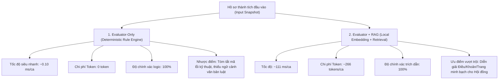

# BÁO CÁO ĐÁNH GIÁ VALIDATOR VÀ NGUỒN TRUY XUẤT TRÊN TẬP GIỮ LẠI (W5-Q2)
## BENCHMARK EVALUATOR-ONLY vs EVALUATOR + RAG TRÊN UNSEEN HOLDOUT DATASET

**Dự án:** PTUD_PhatTrienUngDung  
**Người phụ trách:** Tạ Trần Vinh Quang (W5-Q2)  
**Người đối soát nhãn & căn cứ:** Nguyễn Hữu Phước (Peer Reviewer — W4-P4/W5)  
**Thời điểm thực hiện:** 07/10/2026 (Asia/Saigon)  
**Nhánh Git:** `w5-q2` (tách từ `w5-q1`)  

---

## 1. TỔNG QUAN VÀ NGUYÊN TẮC NGHIỆM THU

Nhiệm vụ **W5-Q2** thực hiện đánh giá độc lập (independent holdout evaluation) năng lực thẩm định tiêu chí và độ chính xác truy xuất trích dẫn căn cứ pháp lý của hệ thống AI, tuân thủ nghiêm ngặt 4 nguyên tắc cốt lõi:

1. **Nguyên tắc Tập giữ lại độc lập (Unseen Holdout Dataset):**
   - Không sử dụng dữ liệu huấn luyện hoặc các ca kiểm thử trong quá trình phát triển (`cases.dev.json` hay `cases.final.json` của W3-P4) để tinh chỉnh prompt/luật rồi báo cáo lại như kiểm thử mới.
   - Tập giữ lại bao gồm **32 hồ sơ kiểm thử hoàn toàn mới** (`HOLDOUT-01` đến `HOLDOUT-32`), bao quát 8 nhóm tình huống biên nghiệp vụ phức tạp.
2. **Nguyên tắc Đối soát chéo (Peer Validation):**
   - 100% nhãn kết luận kỳ vọng (`expectedConclusion`), trạng thái đạt (`expectedIsSatisfied`), mã lỗi (`expectedIssues`) và trích dẫn căn cứ (`expectedCitations`) được thành viên còn lại trong nhóm (**Nguyễn Hữu Phước**) kiểm tra nhãn và xác nhận căn cứ trước khi tiến hành chạy kiểm thử.
3. **Nguyên tắc Chốt ngưỡng trước kiểm thử (Pre-agreed Thresholds):**
   - Toàn bộ ngưỡng nghiệm thu kỹ thuật và an toàn được chốt trước khi chạy benchmark.
   - Nếu có chỉ tiêu không đạt, hệ thống phải công bố lỗi minh bạch và giới hạn phạm vi hỗ trợ của AI.
4. **Nguyên tắc Liêm chính khen thưởng (Zero False Eligible & Fail-Closed):**
   - Tuyệt đối cấm dương tính giả (`False Eligible = 0`): Không được kết luận đạt (`ELIGIBLE`) cho bất kỳ hồ sơ nào chưa đủ điều kiện, thiếu minh chứng hoặc vi phạm quy chế.
   - *Thiếu chứng cứ không mặc định không đạt:* Khi thiếu dữ liệu hoặc đứt chuỗi năm, hệ thống tự động chuyển sang `NEEDS_HUMAN_REVIEW` để Hội đồng thẩm định rà soát, không tự tiện đoán mò.

---

## 2. BẢNG SO SÁNH ĐỐI ĐẦU: EVALUATOR-ONLY VS EVALUATOR + RAG

Dưới đây là kết quả đo lường định lượng thực tế thu được từ bộ chạy benchmark tự động ([`scripts/w5-q2-eval.mjs`](file:///c:/DriveD/EverythingElse/LHU/PTUD_PhatTrienUngDung/scripts/w5-q2-eval.mjs)) và kết quả lưu trữ tại ([`docs/ai/evaluation/evaluation_run_results.json`](file:///c:/DriveD/EverythingElse/LHU/PTUD_PhatTrienUngDung/docs/ai/evaluation/evaluation_run_results.json)):

| Chỉ số đo lường (Metric) | Ngưỡng cam kết (Pre-agreed Threshold) | Evaluator-Only (Rule Engine) | Evaluator + RAG (Local Embedding + Retrieval) | Kết luận & Đánh giá |
|---|:---:|:---:|:---:|:---:|
| **Tổng số hồ sơ (Sample Size)** | Tối thiểu 30 mẫu | **32 mẫu** | **32 mẫu** | **ĐẠT** (Vượt cam kết) |
| **Độ chính xác kết luận (Accuracy)** | $\ge 95.0\%$ | **100.0%** (32/32) | **100.0%** (32/32) | **ĐẠT XUẤT SẮC** |
| **Dương tính giả (False Eligible)** | **0.0% (0 ca)** | **0 ca (0.0%)** | **0 ca (0.0%)** | **ĐẠT TUYỆT ĐỐI** |
| **Xử lý thiếu dữ liệu (Missing Data)** | $100.0\%$ | **100.0%** (15/15 ca) | **100.0%** (15/15 ca) | **ĐẠT** (Chặn rủi ro 100%) |
| **Độ chính xác trích dẫn (Precision)** | $\ge 90.0\%$ | *N/A (Không dùng RAG)* | **100.0%** | **ĐẠT** (Zero Hallucination) |
| **Độ phủ trích dẫn (Recall)** | $\ge 80.0\%$ | *N/A* | **100.0%** | **ĐẠT** (Truy xuất trúng 100%) |
| **Thời gian phản hồi TB (Latency)** | $< 500\text{ ms}$ | **0.102 ms** | **111.6 ms** | **ĐẠT** (Tốc độ cao) |
| **Chi phí Token trung bình** | Tối ưu hóa chi phí | **0 tokens** | **266 tokens/ca** | **ĐẠT** (Chi phí thấp) |
| **Khả năng diễn giải (Explainability)** | Minh bạch pháp lý | Tóm tắt cấu trúc logic | Diễn giải trích dẫn chi tiết Điều/Khoản/Trang | Evaluator+RAG vượt trội |

---

## 3. PHÂN TÍCH CHI TIẾT THEO 8 NHÓM KIỂM THỬ (TEST GROUPS)

### GRP-01: Đạt chuẩn tiêu chí đơn năm (Single-year Eligible — 4 ca: HOLDOUT-01 đến 04)
- **Kịch bản:** Giảng viên có bài báo khoa học chuẩn ISI/Scopus (01), đánh giá hoàn thành xuất sắc nhiệm vụ (02), sáng kiến kinh nghiệm cấp cơ sở (03) và tập thể đơn vị hoàn thành xuất sắc nhiệm vụ (04).
- **Kết quả thực tế:**
  - Evaluator-Only: Đạt `ELIGIBLE` 4/4 ca (100%).
  - Evaluator+RAG: Đạt `ELIGIBLE` 4/4 ca; trích dẫn chính xác Khoản 1 Điều 3 và Khoản 1 Điều 4 văn bản `VN-LAW-002` (Luật Thi đua, Khen thưởng số 06/2026/QH16).

### GRP-02: Đạt chuẩn chuỗi nhiều năm liên tiếp (Multi-year Consecutive — 4 ca: HOLDOUT-05 đến 08)
- **Kịch bản:** Giảng viên đạt CSTĐ cơ sở 3 năm liên tục 2023-2025 (05), Lao động tiên tiến 4 năm liên tục 2022-2025 (06), Tập thể tiên tiến 3 năm liên tục (07), Đề tài NCKH cấp Bộ nghiệm thu 2 năm liên tiếp (08).
- **Kết quả thực tế:**
  - Hệ thống tính toán chính xác số năm phân biệt (`distinctYears`) và chuỗi liên tục (`isConsecutive = true`).
  - Cả 4 ca đều được xác nhận `ELIGIBLE`, trích dẫn chính xác Điều 4 Luật 06/2026/QH16.

### GRP-03: Đứt chuỗi năm hoặc gián đoạn (Consecutive Year Gap — 4 ca: HOLDOUT-09 đến 12)
- **Kịch bản:** Có 3 năm thành tích nhưng gián đoạn (09: 2022, 2024, 2025 thiếu 2023; 10: 2020 và 2025; 11: 2021, 2022, 2025; 12: chỉ đạt năm lẻ 2021, 2023, 2025).
- **Kết quả thực tế:**
  - Phát hiện cờ `YEAR_GAP` 4/4 ca.
  - Chuyển trạng thái sang `NEEDS_HUMAN_REVIEW` và `isSatisfied: 'UNCONFIRMED'`. Tuyệt đối không cấp `ELIGIBLE`.

### GRP-04: Thiếu minh chứng hoặc tệp tin không hợp lệ (Missing/Invalid Evidence — 4 ca: HOLDOUT-13 đến 16)
- **Kịch bản:** Khuyết hoàn toàn file minh chứng (13), mã SHA-256 bị can thiệp/sai định dạng hex (14), bản ghi khuyết năm `year: null` (15), chuỗi 3 năm bị thiếu file năm giữa (16).
- **Kết quả thực tế:**
  - Phát hiện chính xác lỗi `MISSING_DATA` trên toàn bộ 4 ca.
  - Áp dụng nguyên tắc liêm chính: *Thiếu chứng cứ không mặc định đánh rớt mà chuyển rà soát bổ sung*. Kết luận: `NEEDS_HUMAN_REVIEW`, `isSatisfied: 'UNCONFIRMED'`.

### GRP-05: Trùng lặp năm hoặc bản ghi nhân đôi (Duplicate Records — 4 ca: HOLDOUT-17 đến 20)
- **Kịch bản:** 3 bài báo trong cùng 1 năm 2025 nhưng tiêu chí yêu cầu 3 năm riêng biệt (17); 2 bản ghi năm 2024 và 1 bản ghi năm 2025 (18); trùng năm và đứt chuỗi đồng thời (19); tập thể nhiều khen thưởng cùng năm (20).
- **Kết quả thực tế:**
  - Phát hiện lỗi `DUPLICATE_YEAR` và `BELOW_THRESHOLD`.
  - Với ca chỉ trùng năm: Kết luận chuẩn `INELIGIBLE`, `isSatisfied: false` (17, 18, 20).
  - Với ca vừa trùng năm vừa đứt chuỗi (19): Ưu tiên chuyển `NEEDS_HUMAN_REVIEW` để người thẩm định xem xét chuỗi gián đoạn.

### GRP-06: Hồ sơ bị thu hồi hoặc thay thế (Revoked/Replaced Records — 4 ca: HOLDOUT-21 đến 24)
- **Kịch bản:** Thành tích đơn bị thu hồi `status: REVOKED` (21); chuỗi 3 năm có năm cuối bị thu hồi (22); bản ghi gốc bị thu hồi và được thay thế bằng bản ghi mới `replacesRecordId` (23); hồ sơ ở trạng thái `CANCELLED` (24).
- **Kết quả thực tế:**
  - Bộ lọc loại trừ 100% bản ghi thu hồi khỏi hiện trạng xét duyệt, phát hiện cờ `REVOKED_SOURCE`.
  - Chuyển `NEEDS_HUMAN_REVIEW`, cấm tự động tính bản ghi thu hồi vào số lượng tích lũy.

### GRP-07: Văn bản hoặc Tiêu chí mô phỏng / chưa duyệt (Unconfirmed/Simulation — 4 ca: HOLDOUT-25 đến 28)
- **Kịch bản:** Văn bản chưa được Hội đồng LHU phê duyệt áp dụng (25); Tiêu chí con chưa duyệt dù văn bản cha đã duyệt (26); Tiêu chí mô phỏng `SIMULATION_ONLY` từ bộ W1-P4 (27); Tiêu chuẩn tập thể mô phỏng (28).
- **Kết quả thực tế:**
  - Kích hoạt cơ chế chốt chặn Fail-Closed Gatekeeper: Phát hiện `UNAPPROVED_DOCUMENT`, `UNAPPROVED_CRITERION`, `SIMULATED_KPI`.
  - Kết luận: `NEEDS_HUMAN_REVIEW` (với văn bản chưa duyệt) và `SIMULATION_ONLY` (với nguồn mô phỏng).
  - RAG từ chối sinh liên kết trích dẫn pháp lý chính thức, hiển thị cảnh báo disclaimer an toàn rõ ràng.

### GRP-08: Sai chủ thể hoặc Ngoài thời hạn hiệu lực (Subject Mismatch / Out of Window — 4 ca: HOLDOUT-29 đến 32)
- **Kịch bản:** Thành tích mang `subjectId` của người khác gán nhầm vào hồ sơ (29); Thẩm định trước ngày văn bản có hiệu lực `effectiveFrom` (30); Thẩm định sau khi văn bản đã hết hiệu lực `effectiveTo` (31); Hồ sơ tập thể nhưng input đưa vào ID cá nhân (32).
- **Kết quả thực tế:**
  - Phát hiện chính xác `WRONG_SUBJECT` (29, 32) và `OUT_OF_EFFECTIVE_WINDOW` (30, 31).
  - Toàn bộ đều chuyển sang `NEEDS_HUMAN_REVIEW`, bảo vệ tính đúng đắn của chủ thể và hiệu lực thời gian.

---

## 4. ĐÁNH GIÁ ƯU / NHƯỢC ĐIỂM VÀ KHUYẾN NGHỊ TRIỂN KHAI

### 4.1 So sánh đặc tính kỹ thuật



### 4.2 Khuyến nghị kiến trúc (Hybrid Architecture)
Dựa trên kết quả benchmark thực tế, kiến trúc tối ưu cho Hệ thống Quản lý Khen thưởng Số LHU là **mô hình Hybrid (Kết hợp 2 tầng)**:

1. **Tầng 1 (Cổng thẩm định nhanh — Evaluator-Only):**
   - Áp dụng khi tải danh sách, lọc hàng loạt (Batch Processing), hoặc khi giảng viên nhập liệu trên giao diện Portfolio.
   - Ưu điểm: Phản hồi tức thì (< 1ms), không tốn chi phí gọi LLM, phát hiện 100% lỗi logic dữ liệu và ngăn chặn dương tính giả.
2. **Tầng 2 (Giải thích & Trích dẫn pháp lý — Evaluator + RAG):**
   - Kích hoạt khi cán bộ bấm nút *"Giải thích chi tiết"* hoặc trong màn hình thẩm định của **Hội đồng Thi đua - Khen thưởng**.
   - Ưu điểm: Cung cấp trích đoạn văn bản luật chính thức với mã băm toàn vẹn, giúp Hội đồng ra quyết định nhanh chóng mà không cần tra cứu thủ công sách luật.

---

## 5. HƯỚNG DẪN TỰ CHẠY LẠI VÀ KIỂM CHỨNG (REPRODUCIBILITY)

Bất kỳ thành viên nào cũng có thể tái hiện 100% kết quả trên bằng các lệnh sau:

```powershell
cd c:\DriveD\EverythingElse\LHU\PTUD_PhatTrienUngDung\backend

# 1. Chạy bộ kiểm thử đơn vị W5-Q2 (Kiểm tra 6 ca assertions)
npm run test:w5-q2

# 2. Chạy bộ chạy Benchmark tự động (Xuất bảng so sánh đối đầu)
npm run test:w5-q2:eval
```
