# MÔ HÌNH THỰC THỂ QUAN HỆ (ENTITY RELATIONSHIP DIAGRAM - ERD)
## Hệ thống Quản lý Hồ sơ Thành tích Số & Hỗ trợ Xét duyệt Khen thưởng LHU
**Giai đoạn W1-Q1: Chốt nghiệp vụ, Schema và API lõi**  
**Tác giả:** Tạ Trần Vinh Quang (Phụ trách Backend / Database / Core API)  
**Ngày lập:** 25/09/2026 — **Bàn giao:** 26/09/2026  
**Mã nhiệm vụ:** `[W1-Q1]`

---

## 1. TỔNG QUAN KIẾN TRÚC DỮ LIỆU

Hệ thống cơ sở dữ liệu được xây dựng trên nền tảng **Microsoft SQL Server**, tuân thủ nguyên tắc thiết kế chuẩn hóa bậc 3 (3NF) đối với các bảng giao dịch nghiệp vụ, kết hợp cấu trúc lưu trữ snapshot dữ liệu lịch sử bất biến theo chu kỳ nộp hồ sơ.

### Các phân hệ dữ liệu chính (9 Phân hệ):
1. **Phân hệ Định danh & Xác thực (Identity):** `Users`, `Roles`, `UserRoles`, `RefreshTokens`.
2. **Phân hệ Cơ cấu Tổ chức (Organization):** `OrganizationUnits`, `UserUnitScopes`, `UnitRepresentatives`.
3. **Phân hệ Giảng viên & Công tác (Lecturers):** `Lecturers`, `LecturerAssignments`.
4. **Phân hệ Danh mục dùng chung (Catalogs & Time):** `AcademicYears`, `AchievementTypes`, `AwardTypes`.
5. **Phân hệ Thành tích (Achievements):** `Achievements`, `AchievementSubmissions`.
6. **Phân hệ Minh chứng & Tệp tin (Evidences):** `Evidences`, `EvidenceFiles`, `SubmissionEvidenceFiles`.
7. **Phân hệ Lịch sử & Thẩm định (Verification):** `AchievementStatusHistories`.
8. **Phân hệ Khen thưởng có Quyết định (Awards):** `AwardDecisions`, `AwardDecisionFiles`, `AwardRecords`, `AwardRecordAchievements`, `AwardRecordHistories`.
9. **Phân hệ Hệ thống (System):** `Notifications`, `AuditLogs`.

---

## 2. SƠ ĐỒ THỰC THỂ QUAN HỆ (MERMAID ERD)

```mermaid
erDiagram
    %% ==========================================
    %% 1. IDENTITY & USERS
    %% ==========================================
    Users ||--o{ UserRoles : "has"
    Roles ||--o{ UserRoles : "assigned_to"
    Users ||--o{ RefreshTokens : "owns"
    Users ||--o| Lecturers : "identifies (0..1 to 0..1)"

    %% ==========================================
    %% 2. ORGANIZATION & SCOPES
    %% ==========================================
    OrganizationUnits ||--o{ OrganizationUnits : "parent_of (1 to N)"
    Users ||--o{ UserUnitScopes : "granted"
    Roles ||--o{ UserUnitScopes : "scoped_as"
    OrganizationUnits ||--o{ UserUnitScopes : "scope_unit"
    
    Users ||--o{ UnitRepresentatives : "appointed_as"
    OrganizationUnits ||--o{ UnitRepresentatives : "represented_unit"

    %% ==========================================
    %% 3. LECTURERS & ASSIGNMENTS
    %% ==========================================
    Lecturers ||--o{ LecturerAssignments : "has_history"
    OrganizationUnits ||--o{ LecturerAssignments : "assigned_in"

    %% ==========================================
    %% 4. ACHIEVEMENTS (XOR SUBJECT & CONTEXT)
    %% ==========================================
    Lecturers ||--o{ Achievements : "submits (LecturerId nullable - XOR)"
    OrganizationUnits ||--o{ Achievements : "submits (OrganizationUnitId nullable - XOR)"
    OrganizationUnits ||--o{ Achievements : "frozen_context (ContextUnitId)"
    AchievementTypes ||--o{ Achievements : "categorized_by"
    AcademicYears ||--o{ Achievements : "academic_year"

    Achievements ||--o{ AchievementSubmissions : "has_revisions (1 to N)"
    Users ||--o{ AchievementSubmissions : "submitted_by"

    Achievements ||--o{ AchievementStatusHistories : "has_state_logs"
    AchievementSubmissions ||--o{ AchievementStatusHistories : "linked_submission (0..1)"
    Users ||--o{ AchievementStatusHistories : "acted_by"

    %% ==========================================
    %% 5. EVIDENCES & IMMUTABLE FILES
    %% ==========================================
    Achievements ||--o{ Evidences : "contains"
    Evidences ||--o{ EvidenceFiles : "has_versions (1 to N)"
    
    AchievementSubmissions ||--o{ SubmissionEvidenceFiles : "freezes"
    EvidenceFiles ||--o{ SubmissionEvidenceFiles : "frozen_in"

    %% ==========================================
    %% 6. AWARDS & DECISIONS
    %% ==========================================
    AwardDecisions ||--o{ AwardDecisionFiles : "has_decision_files"
    AwardDecisions ||--o{ AwardRecords : "based_on_decision"
    AwardTypes ||--o{ AwardRecords : "award_type"

    Lecturers ||--o{ AwardRecords : "awarded_to (LecturerId nullable - XOR)"
    OrganizationUnits ||--o{ AwardRecords : "awarded_to (OrganizationUnitId nullable - XOR)"
    OrganizationUnits ||--o{ AwardRecords : "frozen_context (ContextUnitId)"

    AwardRecords ||--o{ AwardRecordAchievements : "links_optional"
    Achievements ||--o{ AwardRecordAchievements : "evidenced_in"

    AwardRecords ||--o{ AwardRecordHistories : "has_histories"
    Users ||--o{ AwardRecordHistories : "acted_by"

    %% ==========================================
    %% 7. NOTIFICATIONS & AUDIT
    %% ==========================================
    Users ||--o{ Notifications : "receives"
    Users ||--o{ AuditLogs : "acted_by (nullable)"

    %% ==========================================
    %% ENTITY DEFINITIONS & FIELDS
    %% ==========================================
    Users {
        bigint UserId PK
        nvarchar Username "UQ"
        nvarchar Email "UQ"
        nvarchar PasswordHash
        nvarchar DisplayName
        nvarchar Status "ACTIVE, LOCKED, INACTIVE"
        bit MustChangePassword
        datetime2 PasswordChangedAt
        datetime2 LastLoginAt
        datetime2 CreatedAt
        datetime2 UpdatedAt
        timestamp RowVersion
    }

    Roles {
        bigint RoleId PK
        nvarchar Code "UQ - LECTURER, MANAGER..."
        nvarchar Name
        nvarchar Description
        bit IsActive
        datetime2 CreatedAt
        datetime2 UpdatedAt
    }

    UserRoles {
        bigint UserId PK,FK
        bigint RoleId PK,FK
        datetime2 ValidFrom
        datetime2 ValidTo
        bigint AssignedBy FK
        datetime2 AssignedAt
    }

    RefreshTokens {
        bigint RefreshTokenId PK
        bigint UserId FK
        nvarchar TokenHash "UQ"
        datetime2 ExpiresAt
        datetime2 RevokedAt
        bigint ReplacedByTokenId FK
        datetime2 CreatedAt
        nvarchar CreatedIp
        nvarchar UserAgent
    }

    OrganizationUnits {
        bigint UnitId PK
        nvarchar Code "UQ"
        nvarchar Name
        nvarchar Type "FACULTY, DEPARTMENT"
        bigint ParentId FK "nullable"
        nvarchar Description
        bit IsActive
        datetime2 CreatedAt
        datetime2 UpdatedAt
        timestamp RowVersion
    }

    UserUnitScopes {
        bigint UserUnitScopeId PK
        bigint UserId FK
        bigint RoleId FK
        bigint UnitId FK
        bit IncludeDescendants
        datetime2 ValidFrom
        datetime2 ValidTo
        bigint AssignedBy FK
        datetime2 CreatedAt
    }

    UnitRepresentatives {
        bigint UnitRepresentativeId PK
        bigint UserId FK
        bigint UnitId FK
        datetime2 ValidFrom
        datetime2 ValidTo
        bigint AssignedBy FK
        datetime2 CreatedAt
    }

    Lecturers {
        bigint LecturerId PK
        bigint UserId FK "UQ, nullable"
        nvarchar EmployeeCode "UQ"
        nvarchar FullName
        nvarchar Email "UQ"
        nvarchar Phone
        nvarchar Title "GVC, PGS, GS..."
        nvarchar Degree "ThS, TS..."
        bit IsActive
        datetime2 CreatedAt
        datetime2 UpdatedAt
        timestamp RowVersion
    }

    LecturerAssignments {
        bigint LecturerAssignmentId PK
        bigint LecturerId FK
        bigint UnitId FK
        bit IsPrimary
        datetime2 ValidFrom
        datetime2 ValidTo
        bigint AssignedBy FK
        datetime2 CreatedAt
    }

    AcademicYears {
        bigint AcademicYearId PK
        nvarchar Code "UQ - 2024-2025"
        nvarchar Name
        date StartDate
        date EndDate
        bit IsCurrent
        bit IsActive
        datetime2 CreatedAt
        datetime2 UpdatedAt
    }

    AchievementTypes {
        bigint AchievementTypeId PK
        nvarchar Code "UQ - RESEARCH_JOURNAL..."
        nvarchar Name
        nvarchar Description
        nvarchar ApplicableSubjectType "LECTURER, UNIT, BOTH"
        bit IsActive
        datetime2 CreatedAt
        datetime2 UpdatedAt
    }

    AwardTypes {
        bigint AwardTypeId PK
        nvarchar Code "UQ - CSTĐ_CS..."
        nvarchar Name
        nvarchar Category "TITLE, REWARD_FORM"
        nvarchar Level "FACULTY, UNIVERSITY, MINISTRY, STATE"
        nvarchar ApplicableSubjectType "LECTURER, UNIT, BOTH"
        nvarchar Description
        bit IsActive
        datetime2 CreatedAt
        datetime2 UpdatedAt
    }

    Achievements {
        bigint AchievementId PK
        bigint LecturerId FK "nullable (XOR with OrganizationUnitId)"
        bigint OrganizationUnitId FK "nullable (XOR with LecturerId)"
        bigint ContextUnitId FK "Snapshot đơn vị lúc tạo"
        bigint AchievementTypeId FK
        nvarchar Title
        nvarchar Description
        nvarchar ContributionRole "Chủ nhiệm, Tác giả chính..."
        date StartDate
        date EndDate
        int RecognitionYear "Năm dương lịch ghi nhận"
        bigint AcademicYearId FK "nullable"
        nvarchar Status "DRAFT, SUBMITTED, VERIFIED..."
        bigint CreatedBy FK
        bigint SubmittedBy FK "nullable"
        bigint ReplacesAchievementId FK "nullable"
        datetime2 CreatedAt
        datetime2 UpdatedAt
        timestamp RowVersion
    }

    AchievementSubmissions {
        bigint SubmissionId PK
        bigint AchievementId FK
        int RevisionNo "Số lần nộp (1, 2, ...)"
        nvarchar SnapshotData "NVARCHAR(MAX) - JSON data"
        bigint SubmittedBy FK
        datetime2 SubmittedAt
        datetime2 CreatedAt
    }

    Evidences {
        bigint EvidenceId PK
        bigint AchievementId FK
        nvarchar Title
        nvarchar Description
        bit IsRemoved
        bigint CreatedBy FK
        datetime2 CreatedAt
        datetime2 UpdatedAt
    }

    EvidenceFiles {
        bigint EvidenceFileId PK
        bigint EvidenceId FK
        int VersionNo "1, 2, ... bất biến"
        nvarchar OriginalFileName
        nvarchar StorageKey "Mã lưu trữ vật lý"
        nvarchar MimeType
        nvarchar FileExtension
        bigint FileSize "Tối đa 10MB"
        nvarchar Sha256Hash "64 hex chars"
        bigint UploadedBy FK
        datetime2 UploadedAt
    }

    SubmissionEvidenceFiles {
        bigint SubmissionId PK,FK
        bigint EvidenceFileId PK,FK
        datetime2 AttachedAt
    }

    AchievementStatusHistories {
        bigint HistoryId PK
        bigint AchievementId FK
        bigint SubmissionId FK "nullable"
        nvarchar FromStatus
        nvarchar ToStatus
        bigint ActorId FK
        nvarchar Reason "Bắt buộc khi bổ sung/từ chối/thu hồi"
        datetime2 CreatedAt
    }

    AwardDecisions {
        bigint DecisionId PK
        nvarchar DecisionNumber
        date DecisionDate
        nvarchar Issuer "Cơ quan ban hành"
        nvarchar Title
        nvarchar Description
        bigint CreatedBy FK
        datetime2 CreatedAt
        datetime2 UpdatedAt
        timestamp RowVersion
    }

    AwardDecisionFiles {
        bigint DecisionFileId PK
        bigint DecisionId FK
        int VersionNo
        nvarchar OriginalFileName
        nvarchar StorageKey
        nvarchar MimeType
        nvarchar FileExtension
        bigint FileSize
        nvarchar Sha256Hash
        bigint UploadedBy FK
        datetime2 UploadedAt
    }

    AwardRecords {
        bigint AwardRecordId PK
        bigint LecturerId FK "nullable (XOR with OrganizationUnitId)"
        bigint OrganizationUnitId FK "nullable (XOR with LecturerId)"
        bigint ContextUnitId FK
        bigint AwardTypeId FK
        bigint DecisionId FK
        int RecognitionYear
        date PeriodStart
        date PeriodEnd
        nvarchar Status "DRAFT, RECORDED, REVOKED"
        bigint RecordedBy FK "nullable"
        datetime2 RecordedAt "nullable"
        bigint ReplacesAwardRecordId FK "nullable"
        datetime2 CreatedAt
        datetime2 UpdatedAt
        timestamp RowVersion
    }

    AwardRecordAchievements {
        bigint AwardRecordId PK,FK
        bigint AchievementId PK,FK
        bigint LinkedBy FK
        datetime2 LinkedAt
    }

    AwardRecordHistories {
        bigint AwardRecordHistoryId PK
        bigint AwardRecordId FK
        nvarchar FromStatus
        nvarchar ToStatus
        bigint ActorId FK
        nvarchar Reason
        datetime2 CreatedAt
    }

    Notifications {
        bigint NotificationId PK
        bigint UserId FK
        nvarchar Type "STATUS_CHANGE, REMINDER..."
        nvarchar Title
        nvarchar Message
        nvarchar EntityType "ACHIEVEMENT, AWARD..."
        bigint EntityId
        bit IsRead
        datetime2 ReadAt
        datetime2 CreatedAt
    }

    AuditLogs {
        bigint AuditLogId PK
        bigint ActorId FK "nullable"
        nvarchar Action "LOGIN, SUBMIT, VERIFY, REVOKE..."
        nvarchar EntityType
        bigint EntityId
        nvarchar OldValues "NVARCHAR(MAX) JSON"
        nvarchar NewValues "NVARCHAR(MAX) JSON"
        nvarchar IpAddress
        nvarchar UserAgent
        nvarchar CorrelationId
        datetime2 CreatedAt
    }
```

---

## 3. GIẢI THÍCH CHI TIẾT CÁC QUAN HỆ TRỌNG YẾU

### 3.1. Ràng buộc chủ thể XOR trên Achievements & AwardRecords
- Cả `Achievements` và `AwardRecords` đều chứa 2 cột: `LecturerId` và `OrganizationUnitId`.
- Mối quan hệ được khống chế bởi ràng buộc toàn vẹn kiểm tra loại trừ: Đúng 1 cột được phép có giá trị, cột còn lại bắt buộc bằng `NULL`.
- Quan hệ với `Lecturers`: Là quan hệ tùy chọn `0..1 -> N`.
- Quan hệ với `OrganizationUnits`: Là quan hệ tùy chọn `0..1 -> N`.

### 3.2. Cột `ContextUnitId` và quan hệ bảo toàn lịch sử
- Luôn là một liên kết bắt buộc `1 -> N` từ `OrganizationUnits` đến `Achievements` và `AwardRecords`.
- Điểm mấu chốt: Cột này giữ nguyên giá trị đơn vị công tác của giảng viên lúc tạo thành tích, không bị cập nhật theo bất kỳ thao tác chuyển đổi đơn vị nào trong `LecturerAssignments`.

### 3.3. Đóng băng minh chứng nhiều phiên bản (`Revision` & `Snapshot`)
- Thành tích kê khai (`Achievements`) liên kết với các minh chứng danh mục (`Evidences`) dạng `1 -> N`.
- Mỗi minh chứng chứa các tập tin vật lý tăng phiên bản `EvidenceFiles` dạng `1 -> N` (quan hệ cha - con bất biến).
- Khi người dùng nộp hồ sơ, bản ghi `AchievementSubmissions` ghi nhận `RevisionNo` tăng dần. Bảng trung gian `SubmissionEvidenceFiles` (quan hệ `N <-> N` giữa `AchievementSubmissions` và `EvidenceFiles`) đóng băng chính xác ID của các tệp tin tại thời điểm nộp.
- Cột `SnapshotData` trong `AchievementSubmissions` lưu trữ toàn bộ cây dữ liệu JSON (thông tin kê khai + danh sách tệp đính kèm) được kiểm tra cú pháp bằng `ISJSON(SnapshotData) = 1`.

### 3.4. Quyết định khen thưởng và chống trùng lặp (`AwardDecisions` & `AwardRecords`)
- Một quyết định khen thưởng (`AwardDecisions`) có thể có nhiều tệp tin đính kèm (`AwardDecisionFiles`).
- Một quyết định khen thưởng có thể được trao cho nhiều đối tượng khác nhau (quan hệ `1 -> N` với `AwardRecords`).
- Ràng buộc duy nhất có điều kiện (Filtered Unique Index) đảm bảo: Cùng một giảng viên (hoặc cùng một tập thể) trong cùng một quyết định và cùng một loại khen thưởng chỉ có duy nhất 1 bản ghi ở trạng thái `RECORDED`.
