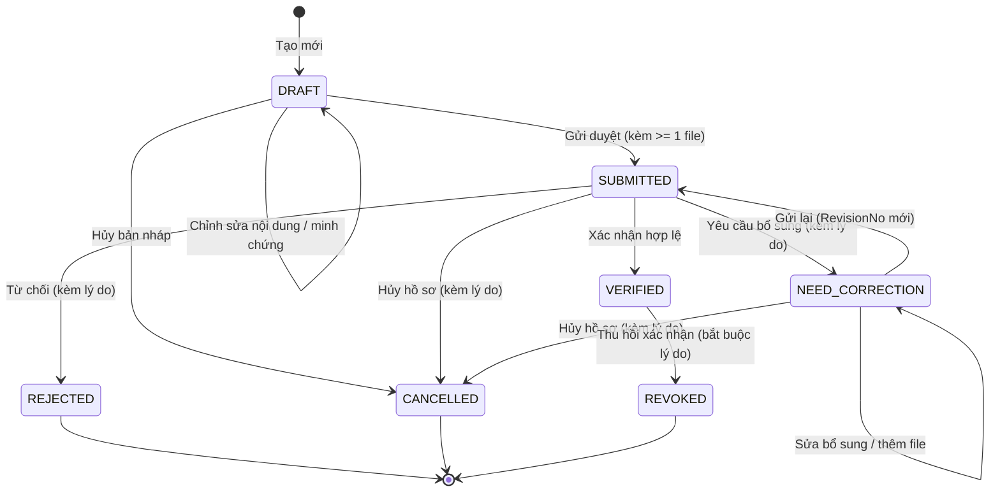

# QUY TẮC NGHIỆP VỤ HỆ THỐNG (BUSINESS RULES)
## Hệ thống Quản lý Hồ sơ Thành tích Số & Hỗ trợ Xét duyệt Khen thưởng LHU
**Giai đoạn W1-Q1: Chốt nghiệp vụ, Schema và API lõi**  
**Tác giả:** Tạ Trần Vinh Quang (Phụ trách Backend / Database / Core API)  
**Ngày lập:** 25/09/2026 — **Bàn giao:** 26/09/2026  
**Mã nhiệm vụ:** `[W1-Q1]`

---

## 1. TỔNG QUAN VÀ PHÂN ĐỊNH KHÁI NIỆM CỐT LÕI

Hệ thống được thiết kế nhằm quản lý tập trung hồ sơ thành tích khoa học - công nghệ, đào tạo và công tác của giảng viên và tập thể các Khoa/Bộ môn thuộc Trường Đại học Lạc Hồng (LHU).

### 1.1. Phân định ba khái niệm nghiệp vụ cốt lõi
1. **Achievement (Thành tích kê khai):** Là kết quả hoạt động cụ thể (bài báo, đề tài NCKH, sáng kiến, giáo trình, công tác giảng dạy...) được kê khai bởi chủ thể, kèm minh chứng tài liệu và trải qua quy trình xác nhận.
2. **AwardRecord (Kết quả khen thưởng đã có quyết định):** Là bản ghi danh hiệu hoặc hình thức khen thưởng (Chiến sĩ thi đua, Bằng khen, Huân chương, Giấy khen...) **đã được cấp có thẩm quyền ban hành quyết định chính thức**, được cán bộ quản lý hồ sơ khen thưởng (`RecordsOfficer`) nhập vào hệ thống.
3. **AwardApplication (Hồ sơ đề nghị xét khen thưởng):** Là hồ sơ nộp để Hội đồng thẩm định xét duyệt trong các kỳ thi đua. Đây là phạm vi mở rộng / Khóa luận tốt nghiệp (KLTN), **không thuộc phạm vi bắt buộc của 13 tuần môn PTUD**.

> **NGUYÊN TẮC VÀNG:**  
> **Xác nhận thành tích (Achievement VERIFIED) KHÔNG đồng nghĩa và KHÔNG tự động trao tặng danh hiệu khen thưởng (AwardRecord RECORDED).**  
> Dashboard, giao diện và API phải tách bạch hoàn toàn số lượng thành tích đã xác nhận và số lượng khen thưởng đã ghi nhận.

---

## 2. QUY TẮC CHỦ THỂ (SUBJECT XOR RULE)

Mỗi hồ sơ thành tích (`Achievements`) và mỗi kết quả khen thưởng (`AwardRecords`) bắt buộc phải thuộc về **đúng một cá nhân giảng viên HOẶC một đơn vị/tập thể**.

### 2.1. Biểu diễn và ràng buộc dữ liệu
- Thuộc tính chủ thể:
  - `LecturerId` (Khóa ngoại trỏ về bảng `Lecturers`): Nhận giá trị `NULL` nếu là thành tích tập thể.
  - `OrganizationUnitId` (Khóa ngoại trỏ về bảng `OrganizationUnits`): Nhận giá trị `NULL` nếu là thành tích cá nhân.
- **Ràng buộc CHECK loại trừ (XOR):**
  ```sql
  CONSTRAINT CK_Achievements_Subject_XOR CHECK (
      (LecturerId IS NOT NULL AND OrganizationUnitId IS NULL) OR
      (LecturerId IS NULL AND OrganizationUnitId IS NOT NULL)
  )
  ```
  ```sql
  CONSTRAINT CK_AwardRecords_Subject_XOR CHECK (
      (LecturerId IS NOT NULL AND OrganizationUnitId IS NULL) OR
      (LecturerId IS NULL AND OrganizationUnitId IS NOT NULL)
  )
  ```
- Tuyệt đối không cho phép bản ghi không có chủ thể (`both NULL`) hoặc vừa thuộc cá nhân vừa thuộc tập thể (`both NOT NULL`).

### 2.2. Hoạt động phối hợp / Nhiều tác giả
- Khi một công trình NCKH hoặc đề tài có sự tham gia của nhiều giảng viên: Hệ thống **không** tự động nhân bản thành tích cho toàn bộ tác giả.
- Từng giảng viên tham gia sẽ tạo hồ sơ kê khai thành tích riêng cho cá nhân mình, đính kèm minh chứng chứng minh vai trò đóng góp qua thuộc tính `ContributionRole` (ví dụ: `Chủ nhiệm đề tài`, `Tác giả chính / First Author`, `Tác giả liên hệ / Corresponding Author`, `Đồng tác giả`, `Thành viên nghiên cứu`).
- Thành tích tập thể thuộc về chính đơn vị đó (Bộ môn hoặc Khoa), **không** được tự động suy diễn bằng cách cộng dồn thành tích của các cá nhân trong đơn vị.

---

## 3. QUY TẮC BỐI CẢNH ĐƠN VỊ (`ContextUnitId`) VÀ LỊCH SỬ TỔ CHỨC

### 3.1. Mục đích của `ContextUnitId`
Mỗi thành tích hoặc khen thưởng đều gắn với một thuộc tính bắt buộc: `ContextUnitId` (`bigint NOT NULL FK -> OrganizationUnits`).
- Với thành tích tập thể: `ContextUnitId = OrganizationUnitId`.
- Với thành tích cá nhân: `ContextUnitId` là đơn vị công tác chính của giảng viên **tại thời điểm phát sinh/tạo hồ sơ thành tích** (lấy từ bản ghi `LecturerAssignments` có hiệu lực tại ngày kê khai).

### 3.2. Tính bất biến khi chuyển đơn vị công tác
- Khi giảng viên luân chuyển công tác (ví dụ: chuyển từ Bộ môn Kỹ thuật Phần mềm sang Bộ môn Trí tuệ Nhân tạo, hoặc sang Khoa khác):
  - Bản ghi `LecturerAssignments` cũ sẽ được đóng thời hạn (`ValidTo = ngày kết thúc`).
  - Bản ghi `LecturerAssignments` mới được tạo với đơn vị mới.
  - **`ContextUnitId` trên các thành tích và khen thưởng đã tạo trong quá khứ TUYỆT ĐỐI BẤT BIẾN.**
- **Quy tắc truy cập và báo cáo lịch sử:**
  - Cán bộ quản lý (`Manager`) của đơn vị cũ vẫn xem và khai thác báo cáo các thành tích mang `ContextUnitId` thuộc đơn vị cũ trong giai đoạn trước.
  - Cán bộ quản lý (`Manager`) của đơn vị mới không tự động quản lý hay duyệt các hồ sơ thuộc đơn vị cũ.
  - Bản thân giảng viên chủ thể vẫn luôn xem được toàn bộ danh mục thành tích của chính mình xuyên suốt quá trình công tác tại trường.

---

## 4. QUY TẮC MINH CHỨNG SỐ VÀ PHIÊN BẢN BẤT BIẾN (EVIDENCE & IMMUTABILITY)

### 4.1. Quan hệ thành tích và minh chứng
- Trong phạm vi PTUD, mỗi minh chứng (`Evidences`) thuộc về đúng một thành tích (`AchievementId`).
- Một thành tích có thể có một hoặc nhiều minh chứng kèm theo.
- Điều kiện tiên quyết để gửi duyệt: **Hồ sơ thành tích phải có ít nhất một minh chứng hợp lệ kèm file.**

### 4.2. Tính bất biến của phiên bản file (`EvidenceFiles`)
- Tập tin vật lý khi tải lên kho lưu trữ riêng (`Private Storage`) sẽ được gán mã định danh duy nhất (`StorageKey`), kiểm tra MIME type, kích thước tối đa 10MB và tính mã băm toàn vẹn `Sha256Hash`.
- Các định dạng được phép: `.pdf`, `.jpg`, `.jpeg`, `.png`, `.docx`.
- File là tài sản bất biến (Append-only):
  - Khi người dùng muốn cập nhật hoặc bổ sung file cho minh chứng, hệ thống tạo bản ghi `EvidenceFiles` mới với `VersionNo = VersionNo + 1`.
  - Tuyệt đối không ghi đè nội dung file cũ trên ổ đĩa và không sửa metadata của phiên bản cũ.

### 4.3. Đóng băng dữ liệu theo lần gửi (`AchievementSubmissions` & `SubmissionEvidenceFiles`)
- Mỗi lần chủ hồ sơ thực hiện hành động **Nộp** (`DRAFT -> SUBMITTED` hoặc `NEED_CORRECTION -> SUBMITTED`):
  1. Tăng số thứ tự lần nộp `RevisionNo = RevisionNo + 1`.
  2. Tạo bản ghi `AchievementSubmissions` chứa snapshot JSON toàn bộ thông tin hồ sơ tại thời điểm gửi (`SnapshotData`).
  3. Tạo các liên kết trong `SubmissionEvidenceFiles` trỏ chính xác đến phiên bản `EvidenceFileId` mới nhất tại thời điểm bấm gửi.
- Cán bộ duyệt (`Manager`) khi xem xét hồ sơ sẽ xem đúng snapshot và các file đã được đóng băng của lần gửi đó, ngăn ngừa hiện tượng người kê khai ngầm chỉnh sửa nội dung trong lúc đang chờ duyệt.
- Minh chứng và file đã từng nằm trong một lần nộp (`SubmissionEvidenceFiles`) **không bao giờ được phép xóa cứng khỏi hệ thống**.

---

## 5. QUY TRÌNH XÁC NHẬN THÀNH TÍCH (WORKFLOW & STATE MACHINE)

Quy trình xác nhận thành tích trong đồ án PTUD là quy trình **một cấp xác nhận** theo phân công quản lý.



### 5.1. Bảng chuyển trạng thái (State Transition Matrix)

| Trạng thái hiện tại | Hành động | Tác nhân được phép | Trạng thái tiếp theo | Yêu cầu lý do | Ghi chú nghiệp vụ |
|---|---|---|---|---|---|
| `DRAFT` | Cập nhật | Chủ hồ sơ / Đại diện | `DRAFT` | Không | Sửa tiêu đề, mô tả, vai trò, ngày tháng, thêm/xóa file |
| `DRAFT` | Gửi duyệt (`submit`) | Chủ hồ sơ / Đại diện | `SUBMITTED` | Không | Yêu cầu tối thiểu 1 minh chứng có file. Tạo `RevisionNo = 1`, lưu `SnapshotData` |
| `DRAFT` | Hủy (`cancel`) | Chủ hồ sơ / Đại diện | `CANCELLED` | Không | Có thể xóa mềm hoặc chuyển CANCELLED |
| `SUBMITTED` | Yêu cầu bổ sung (`request-correction`) | Manager hợp lệ | `NEED_CORRECTION` | **BẮT BUỘC** | Ghi rõ nội dung thiếu sót vào `AchievementStatusHistories` |
| `SUBMITTED` | Xác nhận (`verify`) | Manager hợp lệ | `VERIFIED` | Tùy chọn | Khóa dữ liệu vĩnh viễn. Không cho phép sửa/xóa trực tiếp |
| `SUBMITTED` | Từ chối (`reject`) | Manager hợp lệ | `REJECTED` | **BẮT BUỘC** | Trạng thái kết thúc. Không cho phép gửi lại trực tiếp |
| `SUBMITTED` | Hủy (`cancel`) | Chủ hồ sơ / Đại diện | `CANCELLED` | **BẮT BUỘC** | Rút lại hồ sơ đã gửi |
| `NEED_CORRECTION` | Sửa / Bổ sung | Chủ hồ sơ / Đại diện | `NEED_CORRECTION` | Không | Tải thêm phiên bản file mới hoặc điều chỉnh thông tin |
| `NEED_CORRECTION` | Gửi lại (`submit`) | Chủ hồ sơ / Đại diện | `SUBMITTED` | Không | Tạo `RevisionNo = RevisionNo + 1`, tạo snapshot mới |
| `NEED_CORRECTION` | Hủy (`cancel`) | Chủ hồ sơ / Đại diện | `CANCELLED` | **BẮT BUỘC** | Hủy không tiếp tục bổ sung |
| `VERIFIED` | Thu hồi (`revoke`) | Manager hợp lệ | `REVOKED` | **BẮT BUỘC** | Thu hồi khi phát hiện sai phạm hoặc hủy công nhận |

### 5.2. Nguyên tắc bất biến và xử lý sau khi kết thúc
- Các trạng thái kết thúc: `REJECTED`, `CANCELLED`, `REVOKED` **tuyệt đối không thể chuyển về SUBMITTED trực tiếp**.
- Trong trường hợp cần kê khai lại sau khi bị từ chối hoặc sau khi thu hồi: Người dùng phải tạo một bản ghi `Achievements` mới độc lập, và điền mã liên kết vào trường `ReplacesAchievementId` để bảo lưu chuỗi lịch sử truy vết.

---

## 6. QUY TẮC PHÂN QUYỀN PHẠM VI (SCOPE-BASED RBAC) VÀ CHỐNG TỰ DUYỆT

### 6.1. Nguyên tắc gán quyền theo phạm vi
- Một người dùng có thể đảm nhiệm nhiều vai trò (`Roles`).
- Quyền quản lý (`MANAGER`) và quyền đại diện tập thể (`UNIT_REPRESENTATIVE`) **bắt buộc phải gắn với phân công phạm vi (`UserUnitScopes`, `UnitRepresentatives`) còn hiệu lực (`ValidFrom <= NOW <= ValidTo`)**.
- Tuyệt đối không tự động suy diễn quyền quản lý của một người từ chức danh hoặc đơn vị công tác của họ.
- **Kế thừa phạm vi (`IncludeDescendants`):**
  - Nếu Manager được phân công quản lý Khoa (`UnitType = FACULTY`) với `IncludeDescendants = true`: Manager có quyền duyệt thành tích của cả cấp Khoa và tất cả các Bộ môn trực thuộc Khoa đó.
  - Nếu `IncludeDescendants = false`: Chỉ có quyền duyệt thành tích thuộc cấp Khoa.

### 6.2. NGUYÊN TẮC CẤM TỰ DUYỆT (ANTI-SELF-APPROVAL RULE)
Đây là quy tắc kiểm soát liêm chính học thuật và ngăn ngừa xung đột lợi ích tối thượng:

1. **Chủ thể cá nhân:** Manager **TUYỆT ĐỐI KHÔNG ĐƯỢC** thực hiện các hành động duyệt (`verify`, `request-correction`, `reject`) đối với bất kỳ hồ sơ thành tích nào mà `Lecturer.UserId == CurrentUserId`.
2. **Người tạo / Người gửi:** Manager **TUYỆT ĐỐI KHÔNG ĐƯỢC** duyệt hồ sơ do chính mình tạo (`CreatedBy == CurrentUserId`) hoặc do chính mình nộp (`SubmittedBy == CurrentUserId`).
3. **Đại diện tập thể:** Giảng viên đóng vai trò `UnitRepresentative` khi nộp hồ sơ thành tích tập thể của Bộ môn/Khoa thì **không được phép** đồng thời dùng vai trò Manager để tự phê duyệt hồ sơ tập thể đó.
4. **Xử lý khi thiếu người duyệt:** Nếu trong phạm vi đơn vị chỉ có duy nhất một Manager mà hồ sơ cần duyệt lại thuộc diện cấm tự duyệt của Manager đó:
   - Hồ sơ **giữ nguyên trạng thái `SUBMITTED`**.
   - Tuyệt đối không tự động thông qua hoặc bỏ qua bước duyệt.
   - Quản trị viên (`ADMIN`) có trách nhiệm chỉ định phân công bổ sung Manager cấp trên (ví dụ Trưởng khoa hoặc Phó Hiệu trưởng) để thẩm định hồ sơ.

---

## 7. QUY TẮC KIỂM SOÁT ĐỒNG THỜI (OPTIMISTIC CONCURRENCY CONTROL)

Để đảm bảo tính nhất quán dữ liệu khi có nhiều người cùng thao tác (ví dụ hai Manager cùng mở một hồ sơ để duyệt, hoặc giảng viên vừa bấm hủy thì Manager bấm xác nhận):

1. **Cột `RowVersion`:**
   - Tất cả các bảng nghiệp vụ chính (`Achievements`, `AwardRecords`, `OrganizationUnits`, `Lecturers`, `AwardDecisions`) đều có cột `RowVersion timestamp NOT NULL`.
   - SQL Server tự động cập nhật giá trị binary 8-byte này mỗi khi bản ghi có bất kỳ thay đổi nào.
2. **Cơ chế gọi API:**
   - Khi client tải thông tin hồ sơ (`GET`), server trả về chuỗi `rowVersion` (mã hóa Base64 hoặc chuỗi byte).
   - Khi client gửi yêu cầu thay đổi (`PATCH`, `submit`, `verify`, `request-correction`, `reject`, `revoke`), **bắt buộc phải gửi kèm trường `rowVersion` hiện tại** trong payload.
3. **Xử lý xung đột tại Backend:**
   - Câu lệnh cập nhật trạng thái trong SQL kiểm tra đồng thời:
     ```sql
     UPDATE Achievements
     SET Status = @NewStatus, UpdatedAt = SYSUTCDATETIME()
     WHERE AchievementId = @AchievementId 
       AND Status = @ExpectedCurrentStatus
       AND RowVersion = @ClientRowVersion;
     ```
   - Nếu số dòng bị ảnh hưởng (`@@ROWCOUNT`) bằng 0: Backend lập tức rollback transaction và trả về mã lỗi HTTP **`409 CONFLICT`** với mã lỗi `CONCURRENCY_CONFLICT` hoặc `INVALID_STATE_TRANSITION`, yêu cầu người dùng tải lại dữ liệu mới nhất.

---

## 8. QUY TẮC KHEN THƯỞNG CÓ QUYẾT ĐỊNH (AWARD RECORDS)

1. **Căn cứ pháp lý:** Bản ghi khen thưởng `AwardRecords` chỉ được tạo khi đã có quyết định khen thưởng chính thức (`AwardDecisions`), gồm số quyết định, ngày ký, cơ quan ban hành và tập tin đính kèm quyết định (`AwardDecisionFiles`).
2. **Quyền hạn:** Chỉ người dùng có vai trò `RECORDS_OFFICER` trong phạm vi đơn vị mới được phép nhập quyết định và ghi nhận khen thưởng.
3. **Liên kết thành tích:** `AwardRecords` có thể liên kết với một hoặc nhiều `Achievements` đã `VERIFIED` qua bảng `AwardRecordAchievements`. Tuy nhiên, liên kết này là **tùy chọn (optional)** để hỗ trợ việc số hóa các quyết định khen thưởng cũ trong lịch sử trường khi chưa có dữ liệu chi tiết của từng thành tích.
4. **Chống trùng lặp khen thưởng:**
   - Một quyết định khen thưởng có thể trao cho nhiều cá nhân hoặc tập thể.
   - Nhưng **với cùng một chủ thể + cùng một loại danh hiệu/khen thưởng (`AwardTypeId`) + trong cùng một quyết định (`DecisionId`)**: Hệ thống chỉ cho phép tồn tại duy nhất một bản ghi ở trạng thái `RECORDED`.
   - Cơ chế bảo vệ: Sử dụng **Filtered Unique Index** trên SQL Server:
     ```sql
     CREATE UNIQUE NONCLUSTERED INDEX UX_AwardRecords_Lecturer_Recorded
     ON AwardRecords(LecturerId, AwardTypeId, DecisionId)
     WHERE Status = 'RECORDED' AND LecturerId IS NOT NULL;
     ```
5. **Tính bất biến và sửa sai:** Bản ghi đã ở trạng thái `RECORDED` không được phép sửa nội dung. Sửa sai thông qua hành động Thu hồi (`REVOKED` có lý do) và tạo bản ghi thay thế liên kết `ReplacesAwardRecordId`.

---

## 9. NGUYÊN TẮC AN TOÀN TRÍ TUỆ NHÂN TẠO (AI GUARDRAILS & MOCK POLICIES)

Đối với các tính năng phân tích dự báo (trang `/ai-forecast`, phục vụ định hướng KLTN và demo đồ án):

1. **Hỗ trợ quyết định, không thay thế con người:** AI chỉ đóng vai trò trợ lý tổng hợp, đối chiếu và đề xuất (`Decision Support`). AI **tuyệt đối không có quyền tự động ban hành quyết định khen thưởng**, không tự động duyệt thành tích, và không tự ý thay đổi dữ liệu trong cơ sở dữ liệu lõi.
2. **Căn cứ xác thực, không suy diễn:**
   - Mọi kết luận đánh giá điều kiện thi đua của AI phải trích dẫn chính xác nguồn văn bản quy định cụ thể (tên văn bản, số hiệu, điều khoản, trang tài liệu).
   - Nếu dữ liệu hồ sơ thiếu hoặc quy định không rõ ràng, AI phải trả về trạng thái `CHƯA ĐỦ DỮ LIỆU ĐÁNH GIÁ`, tuyệt đối không được tự ý bịa đặt căn cứ hoặc giả định kết quả.
3. **Gắn nhãn dữ liệu KPI mô phỏng:**
   - Trong giai đoạn hiện tại, khi hệ thống KPI ngoài chưa được tích hợp thật: Tất cả các số liệu gợi ý KPI hoặc số liệu dự báo trên giao diện và API **bắt buộc phải gắn nhãn rõ ràng** (`isSimulated: true`, kèm thông điệp: *"Dữ liệu KPI mô phỏng phục vụ nghiên cứu - Chưa kết nối hệ thống KPI chính thức"*).
   - Nghiêm cấm hiển thị số liệu mô phỏng như thể đó là số liệu đã được chứng thực thực tế.

---

## 10. NGUYÊN TẮC BẢO VỆ DỮ LIỆU VÀ AUDIT LOG

1. **Không xóa vật lý lịch sử:** Không sử dụng `CASCADE DELETE` trên bất kỳ bảng lịch sử nào (`AchievementSubmissions`, `EvidenceFiles`, `SubmissionEvidenceFiles`, `AchievementStatusHistories`, `AwardRecordHistories`, `AuditLogs`). Dữ liệu người dùng hoặc đơn vị khi ngừng hoạt động được đánh dấu cờ `IsActive = 0` hoặc trạng thái `INACTIVE`.
2. **Giao dịch nguyên tử (Database Transactions):** Mọi hành vi chuyển trạng thái, tạo snapshot, lưu lịch sử, ghi audit và tạo thông báo phải thực thi trong cùng một transaction database. Nếu bất kỳ bước nào thất bại, toàn bộ thao tác phải được rollback.
3. **Audit Log:** Ghi nhận đầy đủ thông tin: Người thực hiện (`ActorId`), Hành động (`Action`), Thực thể (`EntityType`, `EntityId`), Giá trị cũ/mới (`OldValues`, `NewValues` dạng JSON), Địa chỉ IP và `CorrelationId` để phục vụ thanh tra học thuật.
