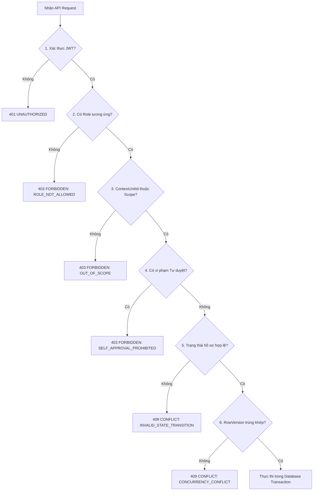

# MA TRẬN PHÂN QUYỀN VÀ PHẠM VI (PERMISSIONS MATRIX)
## Hệ thống Quản lý Hồ sơ Thành tích Số & Hỗ trợ Xét duyệt Khen thưởng LHU
**Giai đoạn W1-Q1: Chốt nghiệp vụ, Schema và API lõi**  
**Tác giả:** Tạ Trần Vinh Quang (Phụ trách Backend / Database / Core API)  
**Ngày lập:** 25/09/2026 — **Bàn giao:** 26/09/2026  
**Mã nhiệm vụ:** `[W1-Q1]`

---

## 1. ĐỊNH NGHĨA VAI TRÒ VÀ NĂNG LỰC HỆ THỐNG

| Mã vai trò (`RoleCode`) | Tên vai trò | Cơ chế gán quyền & Phạm vi áp dụng | Mô tả chức năng chính |
|---|---|---|---|
| `LECTURER` | Giảng viên | Gán trực tiếp qua `UserRoles`. Không phụ thuộc scope quản lý. | Kê khai, quản lý hồ sơ thành tích cá nhân, nộp minh chứng, xem kết quả khen thưởng cá nhân. |
| `UNIT_REPRESENTATIVE` | Đại diện đơn vị | Gán qua `UnitRepresentatives` với `UnitId` và thời hạn `[ValidFrom, ValidTo]`. | Nộp và theo dõi thành tích tập thể của Bộ môn hoặc Khoa được giao đại diện. |
| `MANAGER` | Cán bộ quản lý / Thẩm định | Gán qua `UserUnitScopes` với `UnitId`, cờ `IncludeDescendants` và thời hạn `[ValidFrom, ValidTo]`. | Thẩm định hồ sơ thành tích (yêu cầu bổ sung, xác nhận, từ chối, thu hồi) trong phạm vi đơn vị. |
| `RECORDS_OFFICER` | Cán bộ quản lý hồ sơ khen thưởng | Gán qua `UserUnitScopes` với `UnitId` và thời hạn `[ValidFrom, ValidTo]`. | Nhập quyết định khen thưởng chính thức và ghi nhận kết quả khen thưởng cá nhân/tập thể. |
| `ADMIN` | Quản trị viên hệ thống | Gán trực tiếp qua `UserRoles`. Có hiệu lực toàn hệ thống. | Quản lý danh mục, tài khoản, cấu hình phạm vi, xem audit log hệ thống. **Không mặc nhiên có quyền duyệt thành tích.** |
| `COUNCIL` | Thành viên Hội đồng | Vai trò mở rộng cho KLTN (xét duyệt các danh hiệu thi đua cấp trường/bộ). | Thẩm định hồ sơ đề nghị khen thưởng `AwardApplication` (giai đoạn KLTN). |

---

## 2. MA TRẬN QUYỀN HÀNH ĐỘNG THEO PHẠM VI

Ký hiệu:
- **`YES`**: Cho phép thực hiện.
- **`NO`**: Không được phép.
- **`COND`**: Cho phép có điều kiện (kèm ràng buộc bảo mật & nghiệp vụ).
- **`N/A`**: Không áp dụng.

| Nhóm chức năng | Hành động cụ thể | LECTURER | UNIT_REPRESENTATIVE | MANAGER | RECORDS_OFFICER | ADMIN | Điều kiện ràng buộc & Kiểm tra Backend |
|---|---|:---:|:---:|:---:|:---:|:---:|---|
| **Identity & Hồ sơ** | Đăng nhập, đổi mật khẩu, xem thông tin mình | `YES` | `YES` | `YES` | `YES` | `YES` | Xác thực JWT hợp lệ. |
| | Cập nhật thông tin lý lịch cá nhân | `COND` | `NO` | `NO` | `NO` | `YES` | Giảng viên chỉ sửa hồ sơ của chính mình (`me/profile`). Admin sửa toàn quyền. |
| | Xem hồ sơ tập thể đơn vị | `NO` | `COND` | `COND` | `COND` | `YES` | Đơn vị thuộc phạm vi được phân công quản lý hoặc đại diện. |
| **Thành tích cá nhân** | Tạo bản nháp thành tích cá nhân (`DRAFT`) | `YES` | `NO` | `NO` | `NO` | `NO` | `LecturerId` tự động gán theo UserId hiện tại. `ContextUnitId` = đơn vị công tác chính. |
| | Cập nhật / Xóa bản nháp cá nhân | `COND` | `NO` | `NO` | `NO` | `NO` | Chỉ sửa khi `Status = DRAFT` hoặc `NEED_CORRECTION`. Chỉ xóa khi `DRAFT` chưa gửi. |
| | Đính kèm / Tải lên file minh chứng cá nhân | `COND` | `NO` | `NO` | `NO` | `NO` | Chỉ thêm/sửa file khi hồ sơ ở `DRAFT` hoặc `NEED_CORRECTION`. Max 10MB/file. |
| | Gửi duyệt thành tích cá nhân (`SUBMIT`) | `COND` | `NO` | `NO` | `NO` | `NO` | Bắt buộc có ít nhất 1 minh chứng có file hợp lệ. Chuyển trạng thái sang `SUBMITTED`. |
| | Hủy hồ sơ thành tích cá nhân (`CANCEL`) | `COND` | `NO` | `NO` | `NO` | `NO` | Áp dụng khi ở `DRAFT`, `SUBMITTED`, hoặc `NEED_CORRECTION`. Bắt buộc lý do nếu đã gửi. |
| | Xem lịch sử trạng thái thành tích cá nhân | `COND` | `NO` | `COND` | `NO` | `YES` | Chủ hồ sơ hoặc Manager có scope chứa `ContextUnitId` của hồ sơ. |
| **Thành tích tập thể** | Tạo bản nháp thành tích tập thể (`DRAFT`) | `NO` | `COND` | `NO` | `NO` | `NO` | Chỉ nộp cho đơn vị mà mình được phân công làm đại diện còn hiệu lực. `ContextUnitId = OrganizationUnitId`. |
| | Cập nhật / Xóa bản nháp tập thể | `NO` | `COND` | `NO` | `NO` | `NO` | Đại diện đơn vị chỉ sửa khi `DRAFT` hoặc `NEED_CORRECTION`. |
| | Đính kèm file minh chứng tập thể | `NO` | `COND` | `NO` | `NO` | `NO` | Tương tự quy tắc minh chứng cá nhân. |
| | Gửi duyệt thành tích tập thể (`SUBMIT`) | `NO` | `COND` | `NO` | `NO` | `NO` | Tối thiểu 1 minh chứng có file. Chuyển sang `SUBMITTED`. |
| | Hủy hồ sơ thành tích tập thể (`CANCEL`) | `NO` | `COND` | `NO` | `NO` | `NO` | Bắt buộc lý do nếu đã từng gửi duyệt. |
| **Thẩm định thành tích (Approvals)** | Xem hàng chờ duyệt (`GET /approvals/pending`) | `NO` | `NO` | `COND` | `NO` | `NO` | Chỉ thấy hồ sơ có `ContextUnitId` thuộc scope. **Tự động lọc bỏ hồ sơ của chính Manager.** |
| | Yêu cầu bổ sung (`REQUEST_CORRECTION`) | `NO` | `NO` | `COND` | `NO` | `NO` | Hồ sơ ở `SUBMITTED`, nằm trong scope, **và không vi phạm quy tắc chống tự duyệt**. Bắt buộc nhập lý do. |
| | Xác nhận hợp lệ (`VERIFY`) | `NO` | `NO` | `COND` | `NO` | `NO` | Hồ sơ ở `SUBMITTED`, trong scope, **và không vi phạm tự duyệt**. Kiểm tra `RowVersion`. |
| | Từ chối hồ sơ (`REJECT`) | `NO` | `NO` | `COND` | `NO` | `NO` | Hồ sơ ở `SUBMITTED`, trong scope, **và không vi phạm tự duyệt**. Bắt buộc nhập lý do. |
| | Thu hồi xác nhận (`REVOKE`) | `NO` | `NO` | `COND` | `NO` | `NO` | Hồ sơ ở `VERIFIED`, trong scope, **và không vi phạm tự duyệt**. Bắt buộc nhập lý do. |
| **Khen thưởng đã có QĐ (Awards)** | Nhập quyết định khen thưởng (`AwardDecisions`) | `NO` | `NO` | `NO` | `COND` | `YES` | RecordsOfficer trong đơn vị có thẩm quyền; đính kèm file quyết định gốc. |
| | Tạo bản ghi khen thưởng (`AwardRecords` DRAFT) | `NO` | `NO` | `NO` | `COND` | `YES` | Thuộc phạm vi đơn vị của RecordsOfficer; tuân thủ ràng buộc XOR chủ thể. |
| | Ghi nhận chính thức (`RECORD`) | `NO` | `NO` | `NO` | `COND` | `YES` | Kiểm tra quyết định hợp lệ, kiểm tra chống trùng lặp qua Filtered Unique Index. |
| | Thu hồi bản ghi khen thưởng (`REVOKE`) | `NO` | `NO` | `NO` | `COND` | `YES` | Chỉ thu hồi bản ghi `RECORDED` thuộc phạm vi; bắt buộc nhập lý do thu hồi. |
| **Báo cáo & Thống kê** | Xem thống kê Dashboard cá nhân | `YES` | `NO` | `NO` | `NO` | `NO` | Chỉ hiển thị dữ liệu của cá nhân mình. |
| | Xem thống kê Dashboard đơn vị / Báo cáo | `NO` | `COND` | `COND` | `COND` | `YES` | Dữ liệu được tính toán dựa trên `ContextUnitId` nằm trong scope của người xem. |
| | Xuất dữ liệu CSV | `NO` | `COND` | `COND` | `COND` | `YES` | Dữ liệu xuất khẩu tuân thủ nghiêm ngặt cùng bộ lọc phạm vi scope với báo cáo. |
| **Quản trị hệ thống** | Quản lý Tài khoản, Vai trò, Scope | `NO` | `NO` | `NO` | `NO` | `YES` | Chỉ Admin được phép tạo tài khoản, gán role, phân công scope và đại diện. |
| | Quản lý Danh mục (AchievementTypes, AwardTypes) | `NO` | `NO` | `NO` | `NO` | `YES` | Thêm, sửa, đóng mở danh mục dùng chung. |
| | Xem Audit Log toàn hệ thống | `NO` | `NO` | `NO` | `NO` | `YES` | Tra cứu lịch sử truy cập và thay đổi nhạy cảm. |

---

## 3. CHI TIẾT CÁC ĐIỀU KIỆN KIỂM TRA BẢO MẬT TẠI BACKEND (GUARD CHECKS)

Khi tiếp nhận bất kỳ API request nào, tầng middleware và service của Backend bắt buộc phải tuần tự thực hiện các bước kiểm tra sau:



### 3.1. Thuật toán kiểm tra Scope hợp lệ (`isUnitInScope`)
Giả sử người dùng có danh sách phân công trong `UserUnitScopes`:
- Bước 1: Lấy tất cả các bản ghi scope của `CurrentUserId` có `RoleId = MANAGER_ROLE_ID`, `ValidFrom <= CURRENT_TIMESTAMP` và `(ValidTo IS NULL OR ValidTo >= CURRENT_TIMESTAMP)`.
- Bước 2: Với mỗi scope:
  - Nếu `scope.UnitId == targetContextUnitId` -> **HỢP LỆ (True)**.
  - Nếu `scope.IncludeDescendants == true`:
    - Truy vấn đệ quy cây tổ chức `OrganizationUnits` từ `scope.UnitId` xuống các nút con.
    - Nếu `targetContextUnitId` nằm trong danh sách các đơn vị con -> **HỢP LỆ (True)**.
- Bước 3: Nếu duyệt hết danh sách mà không khớp -> **KHÔNG HỢP LỆ (False)** -> Trả về lỗi `OUT_OF_SCOPE` (HTTP 403).

### 3.2. Thuật toán kiểm tra Chống tự duyệt (`checkAntiSelfApproval`)
Áp dụng cho các thao tác phê duyệt (`verify`, `request-correction`, `reject`, `revoke`):
- **Kiểm tra 1 (Chủ thể là chính mình):**
  - Nếu `Achievement.LecturerId IS NOT NULL`:
    - Lấy thông tin `Lecturers` theo `Achievement.LecturerId`.
    - Nếu `Lecturer.UserId == CurrentUserId` -> **VI PHẠM TỰ DUYỆT**.
- **Kiểm tra 2 (Người tạo hồ sơ):**
  - Nếu `Achievement.CreatedBy == CurrentUserId` -> **VI PHẠM TỰ DUYỆT**.
- **Kiểm tra 3 (Người nộp hồ sơ):**
  - Nếu `Achievement.SubmittedBy == CurrentUserId` -> **VI PHẠM TỰ DUYỆT**.
- Nếu bất kỳ kiểm tra nào vi phạm:
  - Lập tức chặn thực thi và trả về mã lỗi HTTP **`403 FORBIDDEN`** với mã nghiệp vụ:
    ```json
    {
      "success": false,
      "error": {
        "code": "SELF_APPROVAL_PROHIBITED",
        "message": "Cán bộ thẩm định không được phép tự phê duyệt hoặc xử lý hồ sơ thành tích do chính mình tạo, nộp hoặc là chủ thể."
      }
    }
    ```
