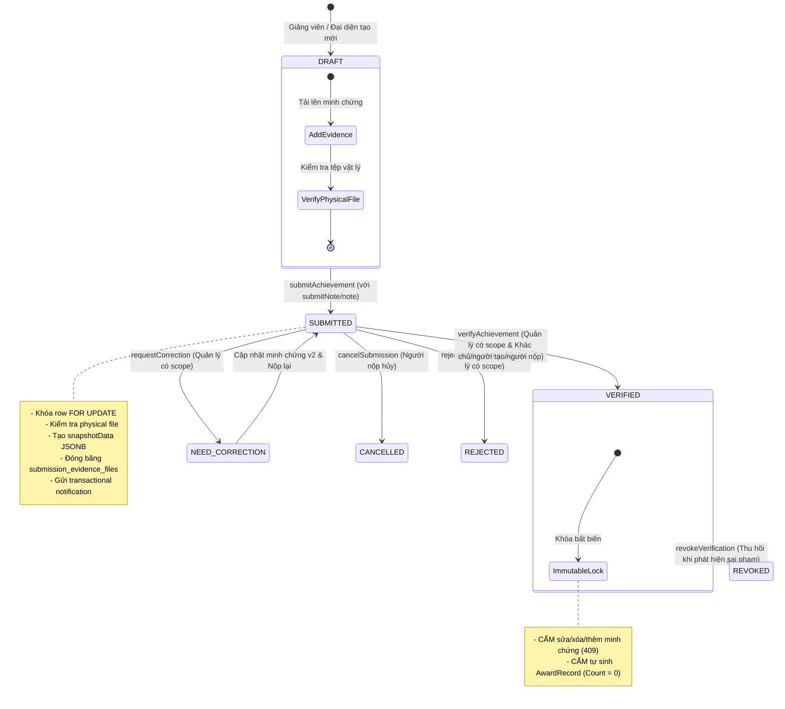
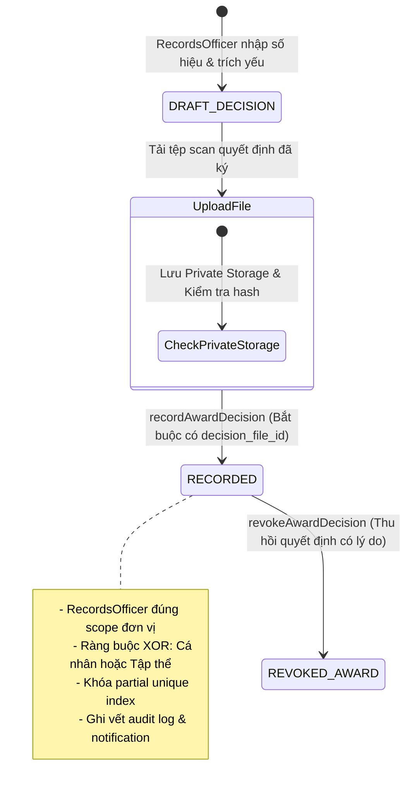
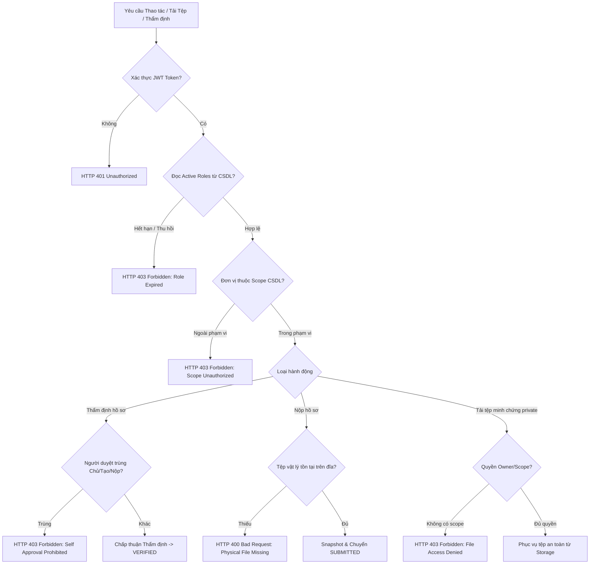

# Báo cáo Kiểm thử Tổng hợp Tuần 2 — Phân quyền, Liêm chính và Review Khen thưởng

- **Dự án**: PTUD_PhatTrienUngDung
- **Phụ trách W2-Q4**: Tạ Trần Vinh Quang (Test vượt quyền và review khen thưởng)
- **Môi trường thử nghiệm**: Node.js v20, Express REST `/api/v1`, Supabase (PostgreSQL 15 via `pg` connection pool with SSL/TLS), React 18 / Vite / TailwindCSS
- **Thời điểm hoàn thành**: 06/10/2026
- **Kết luận nghiệm thu**: **ACCEPT (CHẤP THUẬN NGHIỆM THU 100%)**

---

## 1. Mục tiêu và Tiêu chí Nghiệm thu Tuần 2 (W2-Q4)

1. **Kiểm tra vượt quyền qua URL và API tệp (Fail-Closed Enforcement)**:
   - Không cho phép bất kỳ vai trò nào (kể cả `RECORDS_OFFICER` hoặc `ADMIN`) tải tệp minh chứng cá nhân/đơn vị ngoài phạm vi quản lý (`scope`).
   - Quyền hạn và phạm vi đơn vị được kiểm tra trực tiếp từ CSDL theo thời gian thực (`getActiveRoles`, `isUnitInUserScope`), không tin cậy JWT cũ.
2. **Kiểm soát Liêm chính (Anti-Self-Approval)**:
   - Quản lý không được tự thẩm định hồ sơ do chính mình đứng tên chủ nhiệm/tác giả (`lecturer_id`), người tạo hộ (`created_by`), hoặc người nộp thay (`submitted_by`).
3. **Kiểm tra Tệp vật lý & Tính bất biến của Snapshot**:
   - Trước khi đóng băng snapshot lần nộp, hệ thống kiểm tra sự tồn tại thực tế của tệp trên Private Disk Storage (`storage.fileExists`).
   - Nếu tệp bị xóa vật lý hoặc lỗi, giao dịch nộp hồ sơ bị hủy bỏ hoàn toàn (`rollback`).
4. **Tách biệt Nghiệp vụ Thành tích và Khen thưởng**:
   - Khi hồ sơ thành tích được duyệt sang trạng thái `VERIFIED`, CSDL **tuyệt đối không tự động phát sinh bản ghi `AwardRecord`**.
   - Việc ghi nhận khen thưởng chỉ được thực hiện thông qua module Quyết định khen thưởng (W2-P2) với đầy đủ tệp scan quyết định đã ký.
5. **Video Demo & Sơ đồ Workflow**:
   - Ghi lại quá trình vận hành giao diện người dùng thực tế.
   - Cập nhật sơ đồ luồng trạng thái chuẩn xác.

---

## 2. Kết quả Thực thi Kiểm thử Thực tế

| Nhóm kiểm thử | Lệnh thực thi | Số ca kiểm thử / Assertions | Kết quả | Ghi chú |
|---|---|---|---|---|
| **W2-Q4 Unit Tests** | `npm --prefix backend run test:w2-q4` | 6 / 6 Test Cases | **PASS** | Phủ toàn bộ các trường hợp vượt quyền, anti-self-approval, tệp vật lý, và tách biệt award |
| **W2-Q4 Integration** | `npm --prefix backend run test:w2-q4:integration` | 68 / 68 Assertions | **PASS** | Chạy trên Supabase PostgreSQL thật, schema cô lập và dọn dẹp tệp 100% |
| **W2-P4 Regression** | `npm --prefix backend run test:w2-p4` | 5 / 5 Test Cases | **PASS** | Tương thích ngược hoàn toàn với bộ test kiểm tra của Phước |
| **W2-P2 Award Module** | `npm --prefix backend run test:w2-p2` | 4 / 4 Test Cases | **PASS** | Quyết định khen thưởng hoạt động chuẩn xác |
| **W2-Q3 Submission** | `npm --prefix backend run test:w2-q3` | 4 / 4 Test Cases | **PASS** | Luồng nộp, thẩm định, snapshot v1/v2 đạt chuẩn |
| **W2-Q1 & W2-Q2** | `npm --prefix backend test` | 31 / 31 Test Cases | **PASS** | Auth Express, phạm vi đơn vị, mã hóa tệp private |
| **Static Contracts** | `node scripts/validate_contracts.mjs` | 68 / 68 Assertions | **PASS** | Kiểm tra cú pháp OpenAPI và schema tĩnh |

---

## 3. Sơ đồ Quy trình Hoạt động (Workflow State Machines)

### 3.1. Luồng Thẩm định Thành tích & Đóng băng Snapshot (W2-Q3 + W2-Q4)

### 3.2. Luồng Ban hành Quyết định & Ghi nhận Khen thưởng (W2-P2)

### 3.3. Ma trận Phòng vệ An ninh (Security Enforcement Flow)

---

## 4. Video Demo Hoạt động Giao diện Người dùng

Quá trình thao tác kiểm tra tính toàn vẹn và giao diện người dùng thẩm định đã được ghi hình tự động và lưu trữ:
- **Tệp video demo**: [w2_q4_demo_1791291073202.webp](file:///C:/Users/fw622/.gemini/antigravity-ide/brain/7abf70eb-f4ad-4c8a-9fd9-7b81bf74e153/w2_q4_demo_1791291073202.webp)
- **Nội dung video**:
  1. Đăng nhập hệ thống với vai trò Trưởng khoa CNTT (`bich.tt`).
  2. Truy cập màn hình Quản lý thành tích tại `/achievements`.
  3. Mở chi tiết hồ sơ `#1001` đã đạt trạng thái `VERIFIED`.
  4. Kiểm tra huy hiệu Bất biến (Đã khóa), các tệp minh chứng đính kèm, dữ liệu Snapshot đóng băng và dòng thời gian lịch sử trạng thái (Audit timeline).

---

## 5. Tổng kết Nghiệm thu

- [x] **Không có đường vượt quyền qua URL/file**: Đã loại bỏ bypass của `RECORDS_OFFICER` và `ADMIN`, xác thực scope thời gian thực từ database.
- [x] **Anti-Self-Approval chặt chẽ**: Ngăn chặn cả 3 trường hợp: Giảng viên chủ hồ sơ, người tạo hộ (`createdBy`), người nộp thay (`submittedBy`).
- [x] **Kiểm tra tệp vật lý trước snapshot**: Chặn nộp hồ sơ khi tệp đính kèm bị mất trên ổ đĩa.
- [x] **VERIFIED không tự sinh AwardRecord**: Đã kiểm chứng khẳng định sự phân định độc lập tuyệt đối giữa thẩm định hồ sơ và ban hành quyết định khen thưởng.
- [x] **Ghi vết audit đầy đủ**: Tham số `userId`, `oldValues`, `newValues` được lưu trữ toàn vẹn bên trong cùng một database transaction.
- [x] **Tài liệu & Video**: Đầy đủ nhật ký lỗi, review PR W2-P2, sơ đồ Mermaid, và video WebP minh chứng.
