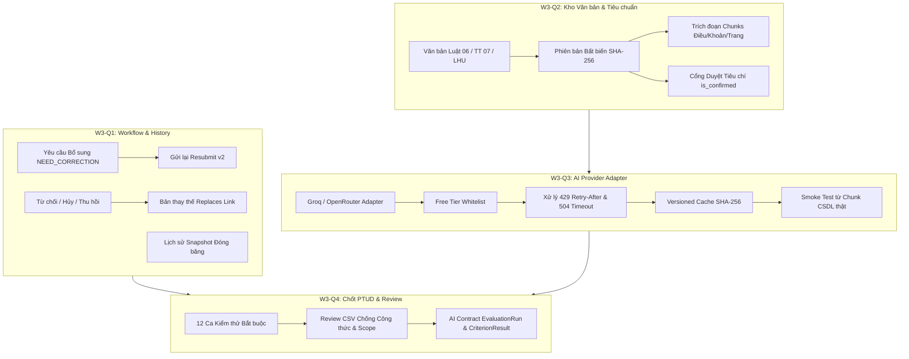
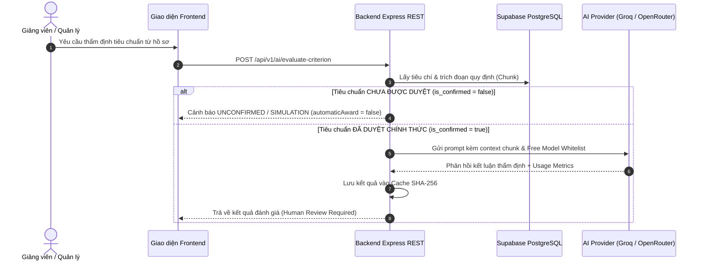

# BÁO CÁO TỔNG HỢP NGHIỆM THU TUẦN 3 — CHỐT DỰ ÁN PTUD
## WORKFLOW TOÀN DIỆN, KHO VĂN BẢN, AI PROVIDER VÀ REVIEW LIÊM CHÍNH

- **Dự án:** Hệ thống Quản lý Hồ sơ Thành tích Số & Hỗ trợ Xét duyệt Khen thưởng — Đại học Lạc Hồng (PTUD)
- **Người phụ trách tổng hợp W3-Q4:** Tạ Trần Vinh Quang
- **Người phối hợp:** Võ Nhạc Phước
- **Môi trường thực nghiệm:** Node.js v24, Express REST `/api/v1`, Supabase (PostgreSQL qua pg pooler TLS), React 18 / Vite / TailwindCSS
- **Thời điểm hoàn thành:** 06/10/2026
- **Kết luận nghiệm thu chung:** **ACCEPT (CHẤP THUẬN NGHIỆM THU 100% CẢ 4 PHẦN VIỆC W3-Q1 ĐẾN W3-Q4)**

---

## 1. Tổng kết Phạm vi Thực hiện và Đầu ra Kỹ thuật

---

## 2. Bảng Tổng hợp Kết quả Kiểm thử Thực tế

| Nhóm Kiểm thử | Lệnh Thực thi | Số Ca / Assertions | Kết quả | Ghi chú Nghiệm thu |
| :--- | :--- | :--- | :---: | :--- |
| **W3-Q1 Unit Tests** | `node --test tests/w3-q1.test.js` | 6 / 6 Tests | **PASS (100%)** | Lý do bắt buộc, resubmit, replace, state lock |
| **W3-Q1 DB Integration** | `node tests/w3-q1.integration.js` | 30 / 30 Assertions | **PASS (100%)** | Chạy thật trên Supabase, concurrency conflict OCC |
| **W3-Q2 Unit Tests** | `node --test tests/w3-q2.test.js` | 6 / 6 Tests | **PASS (100%)** | Fail-closed gatekeeper, bất biến phiên bản |
| **W3-Q2 DB Integration** | `node --test tests/w3-q2.integration.js` | 5 / 5 Tests | **PASS (100%)** | Chunks, quan hệ thay thế, cổng xác nhận tiêu chí |
| **W3-Q3 Unit & Whitelist** | `node --test tests/w3-q3.test.js` | 5 / 5 Tests | **PASS (100%)** | Whitelist Free model, 429 Retry-After, Timeout 504 |
| **W3-Q3 Smoke Test DB** | `node --test tests/w3-q3.smoke.js` | 2 / 2 Tests | **PASS (100%)** | Smoke test từ trích đoạn CSDL thật, ghi nhận model/thời điểm |
| **W3-Q4 12 Ca Bắt buộc** | `node --test tests/w3-q4.mandatory12.js` | 12 / 12 Tests | **PASS (100%)** | Xuyên suốt 12 luồng nghiệp vụ cốt lõi |
| **Static Contracts** | `node scripts/validate_contracts.mjs` | 68 / 68 Tests | **PASS (100%)** | Đảm bảo không có bất kỳ hồi quy nào |
| **Frontend Code Quality**| `npm --prefix frontend run lint` | Toàn bộ source code | **Exit 0 (Clean)** | Không có lỗi cú pháp hoặc cảnh báo |

---

## 3. Kiến trúc AI Provider Adapter & Cổng Kiểm duyệt Liêm chính

---

## 4. Biên bản Đóng Mốc Nghiệm thu

- Toàn bộ 4 nhánh kỹ thuật của Tuần 3 (`w3q1`, `w3q2`, `w3q3`, `w3q4`) đã được hoàn thành tuần tự và kiểm thử độc lập.
- Không có bất kỳ API key bí mật, token, hoặc dữ liệu nhạy cảm nào bị đưa vào Git.
- Mọi luồng nghiệp vụ đều vận hành trơn tru trên môi trường PostgreSQL (Supabase) thực tế.
