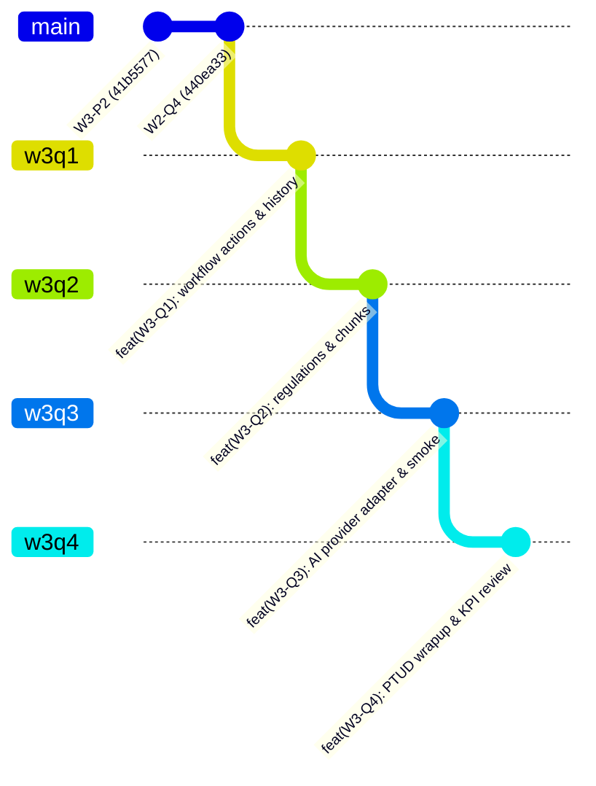

# Kế hoạch Triển khai Tuần 3 (W3-Q1 → W3-Q4)
**Người phụ trách: Tạ Trần Vinh Quang**  
**Dự án: PTUD_PhatTrienUngDung**

---

## 1. Tổng quan lộ trình các nhánh Git

---

## 2. Chi tiết 4 Khối công việc

### Giai đoạn 1: W3-Q1 — Bổ sung, gửi lại, từ chối, hủy và thu hồi (Nhánh: `w3q1`)
- **Mục tiêu**:
  1. Hoàn thiện các API/UI transitions: `request-correction`, `resubmit` (nộp lại từ `NEED_CORRECTION` tăng `revision_no`), `reject`, `cancel`, `revoke`.
  2. Ràng buộc lý do bắt buộc (reason/note validation) và kiểm tra điều kiện trạng thái nghiêm ngặt.
  3. Tạo bản thay thế có liên kết (`replaces_achievement_id`) cho các hồ sơ ở trạng thái kết thúc (`REJECTED`, `CANCELLED`, `REVOKED`).
  4. Duy trì các tệp và snapshot đã gửi trong từng revision; nâng cấp UI History & Snapshot Viewer cho phép đối chiếu các phiên bản gửi cũ.
- **Kiểm thử**:
  - Unit test `w3-q1.test.js`: State machine validation, mandatory reason, anti-tampering, replaces achievement linkage.
  - Integration test `w3-q1.integration.js`: Chạy trên Supabase PostgreSQL thật (Express REST + pg client), OCC concurrency 409, schema cô lập.
- **Bàn giao**: Commit `feat(workflow): [W3-Q1] resubmit revisions, mandatory cancellation/rejection, and replacement achievements`, push lên `origin/w3q1`.

---

### Giai đoạn 2: W3-Q2 — Kho văn bản, phiên bản và tiêu chí được duyệt (Nhánh: `w3q2`)
- **Mục tiêu**:
  1. Thiết kế và chạy migration PostgreSQL: `app.regulation_documents`, `app.regulation_document_versions`, `app.regulation_chunks`, `app.award_criteria_versions`.
  2. API & UI ingestion nguồn chính thức: Mã văn bản, tiêu đề, SHA-256 hash, thời hạn hiệu lực (`effective_from`, `effective_to`), quan hệ thay thế (`supersedes_version_id`).
  3. Bóc tách và lưu trữ các phân đoạn chunk theo điều/khoản/trang (`article_no`, `clause_no`, `page_no`, `content`, `chunk_hash`).
  4. Ràng buộc kiểm soát: Chỉ các tiêu chí được người phụ trách xác nhận (`is_confirmed = true`, `confirmed_by`, `confirmed_at`) mới được đưa vào đánh giá; văn bản chưa duyệt hoặc thiếu xác nhận không được tự động gán nhãn chính sách LHU.
- **Kiểm thử**:
  - Unit test `w3-q2.test.js` & Integration test `w3-q2.integration.js`: Chunk hashing, versioning, confirmation gate.
- **Bàn giao**: Commit `feat(regulations): [W3-Q2] regulation document versioning, chunks, and confirmed criteria gate`, push lên `origin/w3q2`.

---

### Giai đoạn 3: W3-Q3 — Provider Adapter và Thử nghiệm Groq/OpenRouter thật (Nhánh: `w3q3`)
- **Mục tiêu**:
  1. Xây dựng AI Provider Adapter (`backend/src/modules/ai/`): Chuẩn hóa interface gọi mô hình hỗ trợ OpenRouter và Groq (sử dụng free model tier: ví dụ `llama-3.3-70b-instruct:free`, `gemini-2.0-flash-exp:free` hoặc `llama-3.3-70b-versatile`), cơ chế fallback graceful an toàn.
  2. Bảo mật server-side: Cấu hình API key qua biến môi trường server-only, không expose ra frontend hay ghi vào Git; cập nhật `.env.example`.
  3. Quản trị lỗi & Khả năng chịu lỗi: Xử lý timeout, retry có giới hạn, nhận diện HTTP 429 và `Retry-After`, cache kết quả đánh giá theo hash nội dung.
  4. Structured Output: Schema trả về chuẩn xác theo bộ tiêu chí (JSON contract), log usage không lưu bí mật.
  5. Thử nghiệm Smoke Test: Gọi API thật đánh giá tiêu chí dựa trên chunk văn bản của W3-Q2; ghi lại model/thời điểm thật.
- **Kiểm thử**:
  - `w3-q3.test.js` & `w3-q3.smoke.js`.
- **Bàn giao**: Commit `feat(ai): [W3-Q3] AI provider adapter with free models, rate limit handling, and smoke test`, push lên `origin/w3q3`.

---

### Giai đoạn 4: W3-Q4 — Chốt PTUD và Review Báo cáo/KPI (Nhánh: `w3q4`)
- **Mục tiêu**:
  1. Chạy đối soát lại 12 kịch bản bắt buộc của PTUD trên dữ liệu tích hợp thực tế.
  2. Đánh giá phản biện (PR Review) module Reports/CSV (W3-P1) và KPI nội bộ (W3-P2) của Võ Nhạc Phước (chống formula injection, scope kiểm soát, partial unique).
  3. Thống nhất hợp đồng dữ liệu `EvaluationRun` và `CriterionResult` cho việc tích hợp AI trong tương lai.
  4. Đóng gói tài liệu `docs/testing/week-3`, sơ đồ kiến trúc AI và biên bản hoàn tất môn học PTUD.
- **Kiểm thử**:
  - Toàn bộ test suite hồi quy (W1, W2, W3).
- **Bàn giao**: Commit `feat(wrapup): [W3-Q4] finalize PTUD workflow demo, CSV review, and AI contract`, push lên `origin/w3q4`.
