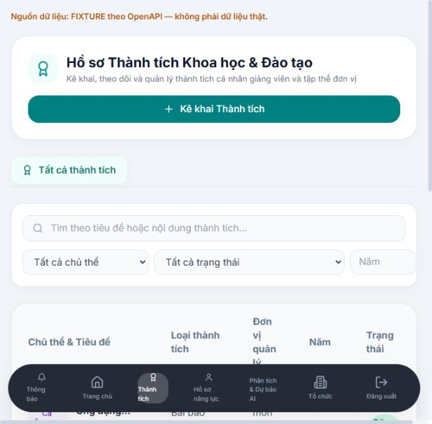
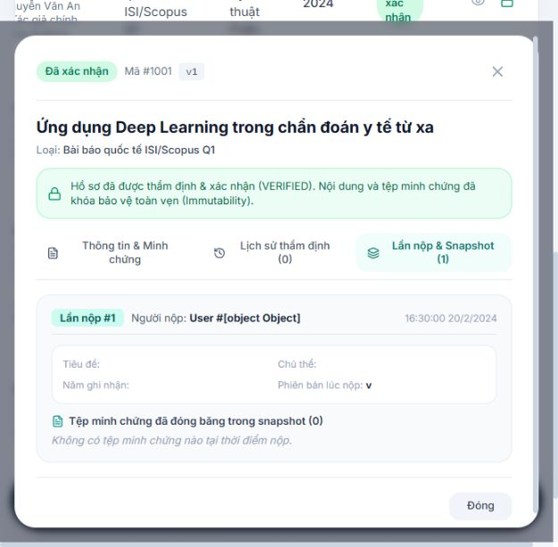
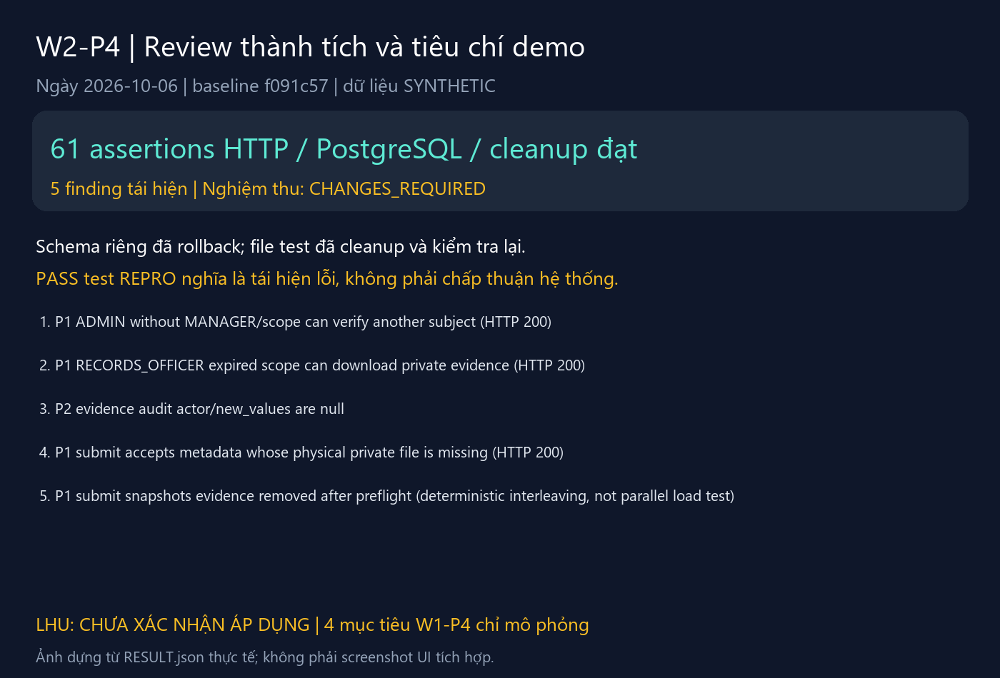

# W2-P4 — Review thành tích và bộ tiêu chí demo

Võ Nhạc Phước · 06/10/2026 · branch `w2-p4` · baseline `f091c57`. Chưa commit/push/merge.

**Đã bàn giao draft, test demo thật và review yêu cầu thay đổi; chưa chấp thuận nghiệm thu nghiệp vụ/file.** W2-Q3 hiện đã có; không tiếp tục ghi là thiếu dependency. Quy chế LHU/tiêu chí nhân sự vẫn **chưa xác nhận áp dụng**.

## File đổi

- `docs/ai/criteria-draft/README.md`: plan W2-P4, áp dụng ADR-001 Supabase PostgreSQL/pg thay SQL Server; giữ auth Express/private file, quy tắc fail-closed và bước tự kiểm tra.
- `docs/ai/criteria-draft/criteria.json`: đúng 4 mục tiêu W1-P4, nguồn/phiên bản/xác nhận, phần máy/người, integration status và blocker từng mục.
- `docs/ai/criteria-draft/sources.json`, `SOURCE_REVIEW.md`: điều khoản Luật06/TT07 đã xem scan chính thức sau 01/10, SHA-256, trang, phạm vi xác nhận; không tự suy ra ngưỡng Q1/Q2 hoặc xét thưởng LHU.
- `docs/ai/criteria-draft/demo.fixtures.json`: KPI mô phỏng có nhãn, không tự điền deadline/mẫu hội đồng.
- `backend/tests/w2-p4.test.js`, `backend/tests/w2-p4.integration.js`, `backend/package.json`: test/script riêng W2-P4, không sửa code Quang.
- `docs/api/W2_P4_DEMO_REVIEW.md`: endpoint thực tế và các điểm khác hợp đồng Q3.
- `docs/reviews/W2_P4_REVIEW_QUANG.md`: review theo baseline/PR công khai, findings và gate nghiệm thu.
- `docs/testing/week-2/W2_P4_RESULT.json`: báo cáo sinh từ test thật, có assertions/observations/acceptance; không chứa token/key/file thật.
- Nhật ký này và 3 ảnh dưới `docs/weekly/images/W2_P4_*.png`.
- `scripts/render_w2_p4_report.py`: dựng ảnh từ RESULT.json để có thể tái tạo báo cáo.

## Kiểm tra thực tế

| Lệnh | Kết quả |
|---|---|
| `npm --prefix backend run test:w2-p4` | 5/5; gồm 1 test REPRO scope bypass |
| `npm --prefix backend run test:w2-p4:integration` | **61 assertions đạt**, Express/pg/Supabase thật, snapshot v1/v2, cá nhân/tập thể, anti-self-approval, scope hết hạn, version, rollback notification, W2-P2 decision/record và kiểm rollback/cleanup; **5 finding tái hiện**, CHANGES_REQUIRED |
| `npm --prefix backend run test:w2-q3` | 4/4 |
| `npm --prefix backend run test:w2-p2` | 4/4 |
| `npm --prefix backend run test:w2-q2` | 4/4; cleanup test cũ chỉ assert có lỗi, chưa chứng minh fileWasDeleted |
| `node scripts/validate_contracts.mjs` | 68/68 kiểm tra tĩnh đạt |
| `git diff --check` | Exit 0; package.json có cảnh báo LF/CRLF |
| `npm --prefix frontend run dev -- --mode fixture --host 127.0.0.1 --port 5174 --strictPort` | Vite chạy, UI fixture đã mở và chụp ảnh |
| `git ls-remote origin refs/heads/w2q3` | Lỗi SEC_E_NO_CREDENTIALS; public GitHub API qua Python urllib đọc thành công |

Test tích hợp không chạy seed/migrate trên schema `app` chung. Tái sử dụng migration và seed đã chốt, rewrite tên schema test riêng trước chạy, outer rollback, cleanup chỉ key do saveFile trong lượt test tạo. Lượt cuối assert schema không còn và các file đã xóa. Harness dùng một pg client và savepoint: test tuần tự và interleaving dựng có kiểm soát, không khẳng định đã kiểm transaction song song.

Không sửa frontend nên không chạy lại lint/build. Không chạy integration Q3 cũ vì dùng ID tài khoản cố định trên DB chung; W2-P4 đã chạy luồng thực tế trong schema rollback. Lỗi HTTP 500 notification là lỗi chủ động inject để chứng minh rollback, không phải lỗi môi trường ngoài dự kiến.

## Ảnh tuần 2 — phân biệt chế độ

06/10/2026, `http://127.0.0.1:5174/achievements`, `VITE_DATA_SOURCE=fixture`, tài khoản và các bản ghi mẫu repository. Banner xác định dữ liệu mô phỏng. Ảnh giao diện không thay thế kết quả tích hợp Supabase.

Ảnh fixture của modal #1001: người nộp hiển thị `[object Object]`, snapshot trống/file 0. Khi mở chi tiết hàng SUBMITTED, fixture API luôn trả hồ sơ VERIFIED đầu tiên. Đây là finding UI/fixture; không mô tả snapshot API thật (API thật đã test v1/v2).

Ảnh tổng hợp được dựng từ RESULT.json và kết quả lệnh thực tế, không phải screenshot UI tích hợp. Acceptance CHANGES_REQUIRED.

## Tự kiểm tra và phần chưa xong

Chạy các lệnh W2-P4; mở `criteria.json`, đối chiếu nguồn/phiên bản và machine/human. Demo API/UI theo README criteria: thêm file → submit → Manager yêu cầu bổ sung → thay v2 → resubmit → verify; so snapshot v1/v2, thử owner/outsider/expired scope/representative/version cũ và khóa VERIFIED. Với W2-P2, thiếu file không record; quyết định có file và RecordsOfficer đúng scope mới ghi nhận. Đừng dùng gợi ý Q1/Q2/phần trăm trên UI AI làm căn cứ.

Còn chặn bởi findings quyền/scope, file preflight/snapshot, file vật lý, audit và contract/UI fixture; xem review. Chưa kiểm concurrent transactions, mọi nhánh reject/cancel/revoke/thu hồi role, ảnh UI với API thật, mẫu hội đồng/hướng dẫn/KPI thật và deadline được xác nhận. LHU cần cung cấp quy chế nhân sự/phụ lục/phiên bản/chuyển tiếp/người xác nhận để bật tiêu chí thật. Không dùng tin/chỉ mục LHU hoặc quy chế sinh viên thay căn cứ.

GitHub public API trả 3 PR cũ, chưa có PR W2-P2/Q3 tại thời điểm kiểm tra. Review cục bộ theo commit đã sẵn sàng; chưa đăng review GitHub/tạo PR. Không đưa credentials hoặc dữ liệu thật vào Git.

Commit đề xuất: `docs(test): [W2-P4] review submit files and draft sourced demo criteria`. Chưa thực hiện commit, push hoặc merge.
